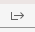
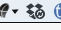

Title: Tutorial  
Author: Keith Blount

# The Basics #

## Get Oriented ##

### Main Interface ###

Scrivener's main interface comprises the following:

* The list on the left is called the **binder**, because it acts as the project's ring-binder, being where you file and organise all of your material.
* The **editor** contains the text you are reading right now, and is where you'll do all your writing. It can also show research documents, such as images and PDF files.
* If you click on the "i" in the right of the toolbar (the strip of buttons at the top of the window), you'll open the **inspector**. The inspector displays information relating to the document currently shown in the editor, such as its synopsis, label and status.

Let's start by looking at the binder in a little more detail---in the binder sidebar, click on the document entitled "The Binder".

#### The Binder ####

# Using the Binder

The binder is the main navigation tool in Scrivener. You use it to access different parts of your project, as well as to create new sections and arrange them. (***Note:*** we refer to each section in the binder as a "document", but each document can contain as much or as little text as you like.)

The basics are simple:

* Click on a document to open it in the editor.
* Click on the triangle next to a folder or group to show or hide (*expand* or *collapse*) its contents (*subdocuments*).
* Drag and drop documents to rearrange them.
* Double-click on a document to rename it.
* Click "+" in the footer at the bottom of the binder (or in the toolbar) to create a new document. (**Cmd-N**)
* To create a new folder, click the button containing a folder with a "+" inside it at the bottom of the binder, or click the down arrow next to the "+" button in the toolbar. (**Opt-Cmd-N**)
* You can also add new documents from the **Project** menu or by hitting enter when a document is selected and the binder has the focus.
* Import files into Scrivener by dragging them from the Finder into Scrivener's binder. Alternatively, use **File \> Import \> Files...** in Scrivener's main menu at the top of the screen.

# Special Folders

Along with anything else you add, the binder always contains three special folders that cannot be removed:

1. The **Draft** folder. Anything you want to be part of your finished manuscript should be placed inside this folder. Its contents will be compiled into a single document when you export or print using **File \> Compile...** Because the Draft folder is used for building your manuscript, it is unique in that it can *only* hold text files---you cannot import image or research files into this folder.
    * ***Tip:*** If you want an image in the text of your manuscript, place the cursor inside a text document in the Draft and use **Insert \> Image From File...** to insert the image into the text.
    * ***Note:*** All folders and files can be renamed, even the special folders. In some of Scrivener's project templates, the Draft folder has a different name, such as "Manuscript".
2. The **Research** folder can hold text or media files (images, PDF files, video files and more), and is the default storage location for research materials not intended for inclusion in the final manuscript. You don't have to put all your research files into the Research folder, though---you can create other folders for your support materials anywhere you want.
3. Whenever you delete a document, it ends up in the **Trash** folder. *Documents are not deleted forever until you select* **Empty Trash...** *from the* **Project** *menu*.

# There's Nothing Special About Other Folders

In Scrivener, there's no real difference between folders (excepting the three special folders) and text files. A folder is just a special kind of text file that has a different icon and opens in a different editor view mode by default (we'll get to view modes shortly).

You can convert a folder document to a text document and vice versa easily. Try this now:

* Ctrl-click (or right-click) on "Get Oriented" in the binder (directly beneath the yellow "The Basics" folder).
* From the contextual menu that appears, select **Convert to File**. Note how the folder icon becomes a text stack icon.
* Ctrl-click (or right-click) on "Get Oriented" again. You'll see that the option is now **Convert to Folder**---click it to convert back. (You can also convert from the **Documents** menu.)

So, whether you prefer to use folders or text groups is entirely up to you, and you can convert between them at any time. (***Note:*** A text or file group is any non-folder that has subdocuments.)

# Searching

To search for documents in the project:

1. Click on the magnifying glass in the toolbar. A search field will appear at the top of the binder.
2. Enter text in the search field. The binder will be replaced with a purple search results list.
    * ***Tip:*** Click on the magnifying glass icon in the left of the search field to change search options.
3. Click on the "X" in the left of the search results header bar to return to the binder, or click on the magnifying glass in the toolbar again.

![][CloseSearch]

1. Click on the magnifying glass in the toolbar to hide the search field if it is still visible.

You can also run a quick search for documents using Quick Search field in the toolbar (which currently shows "The Binder", the current document name). This works like the search field in Safari and brings up a menu of the top results. This is great when you know the title of the document you want to find.

Now let's take a look at the editor---click on "The Editor" in the binder.

#### The Editor ####

The text you are reading now is contained in the editor. There are several ways to load a document into the editor, but the one you will use most often is to select a file in the binder, as you did to load this one.

Scrivener's editor can display a range of different file types, so let's try loading an image:

* In the binder, scroll down to the "Research" folder (you might need to expand it by clicking on the triangle next to it first) and then click on "Sunset".
* Once you've tested that out, return here.

# Using the Editor

* The **Format Bar** appears directly below the toolbar. It provides easy access to many common formatting controls, such as bold, italics, paragraph alignment and spacing, and highlights.
* More formatting features can be found in the **Format** menu.
* The **Insert** menu allows you to insert images, tables, footnotes, comments and other elements into the text.
* **Edit \> Find \> Find...** in the main menu or using the keyboard shortcut **Cmd-F** brings up the Find panel, allowing you to search through text in the editor.
* If you're a screenwriter, playwright or comic writer, you can enter scriptwriting mode via **Format \> Scriptwriting**. (You can also toggle between scriptwriting and regular modes using the keyboard shortcut **Cmd-8**.)

# The Header View

The header view (or bar) runs across the top of the editor and contains the name of the document, along with providing some useful tools.

Because in Scrivener you can break your writing up into sections as large or small as you want, you'll spend a lot of time jumping between them in the binder. Frequently, you'll simply want to return to the last document you were looking at. You can do so using the **history navigation buttons**:

* Try clicking on the **back button** (the left-pointing chevron) on the left of the header bar. It will take you to the previous document you were looking at.
* Click on the **forward button** next to it to return here.
* The up and down chevrons on the right of the header view work similarly, except that instead of navigating through the document history, they take you to the next or previous document in the binder.

| :----- |
| ***Note:*** After navigating with the history buttons, the binder selection may not match what is shown in the main editor. (You can thus check back on a document you edited earlier without losing your place.) When the editor shows a different document to the one selected in the binder, a secondary light grey bar appears in the binder to indicate the current editor document. ***Tip:*** Using **Navigate \> Reveal in Binder** tells the binder to select the document currently open in the editor.  |

Also in the header bar:

* You can Control-click (or right-click) into the header view to bring up a menu of useful options.
* You can click into the title to rename the document.
* You can drag the icon shown next to the title in the same way that you can drag documents in the binder.
* You can drag a document from the binder into the header bar to load it.
* The square icon on the very right of the header view will split the editor, but we'll come to that shortly.

# The Footer View

The **footer view** is the horizontal bar beneath the editor. It will contain slightly different controls depending on what is open in the editor.

* When text is open in the editor, its word count is shown in the footer view. (You can change this to show the character count using Scrivener's "Editing" preferences, available from **Scrivener \> Preferences...** in the main menu.) Click on the word count for more information.
    * ***Tip \#1:*** If the word count ever disappears from the footer view, it is most likely because you have switched on scriptwriting mode (see above).
    * ***Tip \#2:*** To see the word count of your entire draft, hover over the search field in the toolbar with your mouse. Doing so will display a count of all the words in the Draft folder (on the left) and a count of the words you have written in the current session (on the right).
    * ***Tip \#3:*** You can set a word or character count target for your manuscript via **Project \> Show Project Targets**. (You can also set targets for individual documents by clicking on the target icon in the footer view.)
* You can change the current text scale (zoom) using the percentage control on the left of the footer view. (This does not change the font size; it just zooms in and out of the document.)
* When viewing PDF files, the footer view allows you to navigate between the pages. Click on "spacewalk\_info" in the Research folder to test this out, and then come back here by clicking on the "back" arrow in the header view.

At this point, now that you know how to use the binder and editor, you could go off and start using Scrivener, because the binder and editor are the two features you'll be using the most. So if you're itching to jump in, feel free to go and create your own project (**File \> New Project...**) and experiment. Just know that, like Luke Skywalker at the end of *The Empire Strikes Back*, you're not fully trained in the ways of the Force just yet. Be sure to come back to Dagobah here as soon as you're ready to continue your training.

Ready? Okay, click on "The Inspector" in the binder (or the down chevron on the right of the header view) and let's do ourselves some inspecting.

#### The Inspector ####

Click the blue "i" icon on the right of the toolbar to open the inspector. The inspector will appear as a third pane on the right of the window, and it shows extra information associated with the document that you have open in the editor.

At the top of the inspector you will see these buttons:

![][Screenshot2020-11-12at180437]

These buttons change what is displayed in the inspector. From left to right, they are:

* **Notes:** The document synopsis and notes.
* **Bookmarks:** Bookmarks associated with the document and project.
* **Metadata:** Various metadata relating to the document.
* **Snapshots:** Snapshots you have taken of the document. (Snapshots are older versions of the document.)
* **Comments & Footnotes:** Comments and footnotes associated with the text in the editor.

The buttons available will change depending on what sort of document is shown in the editor. For instance, "Snapshots" and "Comments & Footnotes" are only available for text documents.

A dot in the corner of one of these buttons indicates that there is content in the associated pane.

Let's start by clicking on the Notes button. Once you've done that, select "Synopsis & Notes" in the binder.

##### Synopsis & Notes #####

# Synopsis Index Card

At the top of the Notes pane of the inspector is a virtual index card, in which you can type a synopsis of your document (the header of the index card can be used to rename the document, too).

A core idea behind Scrivener is that every section of the project is associated with a synopsis which can be viewed either alongside the section text (in the inspector) or alongside other synopses (in the corkboard or outliner). This allows you to switch between an overview of your manuscript and its text.

Imagine it like this: each document in Scrivener is a sheet of paper with an index card clipped to it. You can scrawl a summary of the document onto the index card, and then you can take the card and lay it out alongside other index cards to work with the bigger picture. (We'll see that bigger picture when we come to look at the corkboard and outliner views.)

# Notes

Below the index card is the notes area, where you can jot down anything relating to the document that you don't want in the text itself, such as ideas and problems.

On to "Label & Status"...

##### Label & Status #####

At the bottom of the inspector are the label and status pop-up buttons. (This document's label is "Blue" and its status is "To Do".)

Label and status are simply arbitrary tags that you can assign to a document. You set up the label and status tags you want to use in a project by going to **Project \> Project Settings...** You might, for example, rename "Label" to "POV" (for Point of View) and use it to record the name of the point-of-view characters in a novel, so that you can assign a character to each scene.

Status works much the same way, except that it is meant to keep track of the state of the document---for instance, "Finished", "To do", "A Mess" and so forth---although you can rename it and use it for anything you want. The only real difference between label and status is that labels have colours associated with them, and status items do not.

| :----- |
| ***Tip:*** To assign a label or status to multiple documents, select several documents in the binder, Ctrl- or right-click on them, and select the label or status from the contextual menu that appears. |

Next, click on "Bookmarks" in the binder.

##### Bookmarks #####

Click on the Bookmarks button in the inspector header bar (the second icon).

The Bookmarks pane allows you to store references to other documents in the project, on your hard-disk, or on the internet.

To add a new bookmark, do one of the following:

* Click the ![][ellipsis-circle] or ![][gear-icon] button (depending on which version of macOS you are runing)  above the Bookmarks list.
* Drag a document from the binder into the list.
* Drag a file from the Finder into the list.
* Drag a URL from a browser into the list.

Selecting a bookmark in the list opens the content of the bookmark in the lower half of the inspector. You can see that the "Key Concepts" document has been added as a bookmark for this document, and that its text can be viewed right there in the inspector. (Click on "Key Concepts" in the Bookmarks list at the top of the inspector if its contents are not visible.)

Double-click a bookmark to open it: external bookmarks open in their default application; internal bookmarks open inside Scrivener.

Bookmarks can be associated with either individual documents or the entire project: click the bar labelled "Document Bookmarks" to switch between Document Bookmarks (specific to the current document) and Project Bookmarks (available from any document).

# Project Bookmarks

Project Bookmarks can also be accessed from the bookmarks icon in the toolbar, providing fast navigation to frequently-needed documents:

* Click the red bookmark icon in the toolbar. A list will appear. I have already added the "START HERE" document to the project bookmarks.
* Click "START HERE" in the list. The bookmarked document will be opened in the editor.
* Hit the back button in the header view to return here afterwards.

Now select "Metadata" in the binder.

##### Metadata #####

Click on the third button in the inspector header bar, the one containing the tag icon, to open the Metadata pane.

Each document in Scrivener can be associated with different types of metadata. Which metadata you use, or whether you use it at all, is entirely up to you.

# General Metadata

At the top of the Metadata pane is "General Metadata". This contains the following:

* **Created Date and Modified Date**: the dates on which the current document was created and last edited.
* **Include in Compile**: if the document is inside the Draft folder, this checkbox determines whether the current document should be included as part of the final manuscript when compiled.
* **Section Type**: used by Compile to determine how to format the current document in the manuscript. We'll look at section types when we come to Compile.

# Custom Metadata

In the middle of the Metadata pane is "Custom Metadata". By default, this pane is collapsed, but you can expand it by clicking either the "Custom Metadata" header bar or the disclosure triangle next to it.

Custom Metadata allows you to add your own checkboxes, pop-up menus, dates and text fields so that you can keep track of any information that doesn't fit elsewhere.

You can set up custom metadata by going to **Project \> Project Settings...** or by clicking the ![][ellipsis-circle-1] / ![][gear-icon-1] icon (depending on macOS version) at the top of the Custom Metadata area. Once you've done this, the custom metadata for each document can be viewed and edited either in the inspector or in the outliner.

# Keywords

You can add arbitrary keywords to your documents to make searching for them easier, or to make keeping track of what is in a particular document easier. For example, you could add keywords for characters that occur in a scene, themes referenced or topics discussed.

**To add a keyword:** Click the "+" button in the Keywords header bar or hit enter while another keyword is selected.

You can also assign keywords via the keywords panel.

1. Click on the ![][ellipsis-circle-2] / ![][gear-icon-2] icon icon in the "Keywords" header bar.
2. Select "Show Project Keywords".

Alternatively, go to **Project \> Show Project Keywords** in the main menu.

Do so now. A panel appears showing all keywords in the project. Here you can create, organise and delete keywords, as well as search the project for selected keywords.

To change the colour associated with a keyword, double-click on its colour chip in the keywords panel.

Drag keywords from the panel to the inspector list to assign them to the current document, or drag and drop them onto documents in the binder, outliner or corkboard to assign them to selected documents there (you can assign keywords to multiple documents this way).

Try dragging the keyword entitled "Assign this one" from the keywords panel to the keywords list in the inspector now.

Okay, on to "Snapshots".

##### Snapshots #####

Scrivener's Snapshots feature keeps older versions of your documents around for reference. To capture a version before embarking on a major edit of a document, select **Take Snapshot** (**Cmd-5**) in the **Documents \> Snapshots** menu. Try that now (you will hear the sound of a camera shutter which indicates that the snapshot has been taken).

Once you have taken a snapshot, you can edit your document safe in the knowledge that you can return to the older version whenever you want.

Click on the "Snapshots" button (the one with the picture of a camera on it) in the inspector header bar to see what I mean.

* The inspector now shows a list of snapshots at the top, which should consist of the one you took and one I took while writing the first version of this tutorial way back in 2006.
* Clicking on a snapshot in the list reveals its text in the lower part of the inspector.
* Restore an older version of your text by selecting the version you want from the list and clicking on **Roll Back** at the top (at which point, you will be given the option of taking another snapshot of your current version).

| :----- |
| ***Note:*** You can immediately tell which documents have snapshots associated with them because their icons have dog-eared corners. |

To see what's changed in the document since the snapshot was taken, click on "Compare". Try that now:

Type some text on the line below (anything you want):

Delete the text in the following line:

DELETE ME!

Now:

* In the inspector, select the snapshot you took a moment ago.
* Click "Compare". See what happens?
    * Text that has been added to the document since the snapshot was taken appears underlined and in blue.
    * Text that has been deleted appears struck out and in red.
    * Note that the comparison only shows *textual* changes---it does not show changes to the formatting.
* Click on the left and right arrows at the top of the inspector, between "Original" and "Roll Back", to navigate between the changes.

| :----- |
| ***Tip:*** You can alter the granularity (level of detail) of the comparison by clicking the ![][ellipsis-circle-3] or ![][gear-icon-3]icon (depending on macOS version) to the right of "Compare" (which should now read "Original", because clicking on it again will turn off the compare feature). Changing the granularity will give different results for different documents, depending on the scope of the edits. You will usually achieve the best results by leaving "By Paragraph" ticked but playing with "By Clause" and "By Word". |

You can also compare the differences between two snapshots by selecting them both in the list and clicking on **Compare**.

Let's move on to "Comments & Footnotes".

##### Comments & Footnotes #####

Now we'll look at the "Comments & Footnotes" pane---don't worry about clicking on the button in the inspector header bar just yet, though.

Click on the yellow highlighted text in the sentence below:

*This sentence has a comment attached.*

Note how the inspector automatically switches to the Comments & Footnotes pane, and the comment associated with the text gets highlighted.

Next, click on the grey footnote directly below the comment in the inspector.

*This sentence has a footnote attached.*[^fn1]

See how clicking on the note in the inspector automatically selects the text associated with it in the editor?

If you click on a note in the inspector, the editor automatically scrolls the text to where the note is located. Try scrolling to the bottom of this document, and then clicking the comment in the inspector to return to the top.

| :----- |
| ***Tip:*** If the comments aren't open in the inspector and you don't want to show them, Opt-click or Cmd-click on a comment or footnote to open it in a popover instead of in the inspector. |

# Adding Comments and Footnotes

Let's try adding some comments and footnotes of our own. First, select some of the text in the following sentence:

*Select some of the text in this sentence.*

Next, do one of the following:

* Click on the paperclip icon in the toolbar and select **Add Comment** from the menu that appears.
* Click the comment icon in the "Comments & Footnotes" bar of the inspector.
* Go to **Insert \> Comment** in the main menu (or hit **Shift-Cmd-8**). A new comment will be created in the inspector ready for editing.

Then:

* Add some text.
* Hit the Escape key to return the focus to the editor.

You add footnotes in exactly the same way, but choosing **Footnote** in the menu or clicking the "cf" icon in the inspector.

| :----- |
| ***Note:*** It doesn't matter where you attach comments, but with footnotes you should always ensure that the footnote link (the grey highlight) ends at the place you want the footnote number to appear when printed or exported. |

# Changing the Colour of Comments

To change the colour of a comment:

1. Ctrl- or right-click on a comment in the inspector.
2. Select a colour from the menu that appears.
3. You can also hit **Shift-Cmd-C** (or go to **Format \> Color** in the main menu) to open the colour palette and choose a custom colour.

(You cannot change the colour of footnotes, which are differentiated from comments by all being grey[^fn2].)

The contextual (Ctrl-click) menu also allows you to convert comments to footnotes and vice versa, and to revert comments and footnotes to use default formatting (which can be set in the "Editing" pane of the Preferences).

| :----- |
| ***Tip:*** If you have a lot of comments, you can collapse individual comments and footnotes by clicking on the disclosure triangle (the downward-pointing arrow) in the top-left of each comment box. |

Right, that's the inspector covered! Now let's take a look at composition mode. By now, you know the drill: click on "Composition Mode" in the binder.

### Composition Mode ###

Composition mode blocks everything else out so that it's just you and your words. To enter composition mode, try one of the following:

* Click on the square, grey icon next to the blue inspector icon in the toolbar.
* Hit **Opt-Cmd-F** on the keyboard.
* Go to **View \> Enter Composition Mode**.

You will now be looking at nothing but your text. (When first entering composition mode, you'll see a message about typewriter scrolling---if you would like to learn more about that feature, see the "Typewriter Scrolling" bookmark in the inspector.)

Here's what you need to know about composition mode:

* When you move the mouse to the bottom of the screen, a control bar appears. This allows you to change the text zoom, the position and width of the virtual paper, and fade the background in and out. It also has buttons to bring up the keywords panel and inspector.
    * ***Tip:*** Holding down the Option key while the control bar is visible changes the "Paper Width" slider to "Paper Height".
* You can customise the look of composition mode in the "Appearance" pane of the Preferences. By default, the regular text colour is overridden to appear as white on a dark grey-blue background, but you can change this to use black-on-white, green-on-black or anything you want.
* You can set a background image for composition mode via **Project \> Project Settings...**
* Switch documents in composition mode by going to **Navigate \> Go To** in the main menu, or by using the "Go To" button in the control bar. (Also, the keyboard shortcuts **Opt-Cmd-Up** and **Opt-Cmd-Down** navigate to the previous and next document in the binder, and **Cmd-\[** and **Cmd-\]** navigate back and forth through the document history.)
* Hit **Opt-Cmd-F** or Escape to leave composition mode (or use the button on the right in the control bar).

Okay, let's leave composition mode now (hit Escape).

Your orientation is now complete! Let's move on to the organisation tools. To access the next section, we're going to do something a little different---be sure to read all of the instructions below before following them:

1. Click on the "Get Organised" folder. Upon so doing, this editor will be replaced by the corkboard---a number of index cards against a light brown background.
2. Once the corkboard appears, in the toolbar, click on the corkboard icon (the centre icon in the group of three next to the search field) to turn it off. Once you've done that, the corkboard in the editor should be replaced with text, and the control in the toolbar should look like this, with no section selected:

![][Screenshot2020-11-12at182025]

Off you go!

## Get Organised ##

The document you are reading now is a folder. As mentioned, there's no significant difference between text and folder documents. The differences are as follows:

1. They have different icons: folder icons are blue, and text document icons are white rectangles.
    * Note that the folder icon for this document ("Get Organised") has a little text icon in its corner. This signifies that this folder contains text---*this* text. (The text icon has nothing to do with the folder having text documents *inside* it, such as "Splitting the Editor" and so on---it means that this folder document itself contains text.)
2. Folder documents always have "disclosure triangles" next to them in the binder even when they have no subdocuments.
3. By default, folders and text documents open in different view modes in the editor. As you saw, this folder opened in corkboard mode before you turned the corkboard off.

We'll come to this third point shortly---first, though, let's look at how you can view more than one document at the same time.

Select "Splitting the Editor" in the binder (you may need to expand "Get Organised" by clicking on the disclosure triangle next to it). Or go get a cup of tea and a biscuit and come back here when you're ready---I'll wait!

### Splitting the Editor ###

When working on a long piece of writing, you may want to refer to research or other parts of the manuscript. In Scrivener, you can split the main editor into two and have different documents (or the same document) open in each.

Let's try that now by going to **View \> Editor Layout \> Split Horizontally**.

Alternatively, click on the button in the right of the editor header view (the square with the horizontal line through its middle):

![][SplitEditor]

This document is now displayed in two panes.

Note:

* Through the **View \> Editor Layout** menu, you can switch to a vertical (side-by-side) split or remove the split to return to a single editor.
* Option-clicking on the split button in the header view toggles between horizontal and vertical split mode. (Make sure the editor is split horizontally for this tutorial - the button splits vertically by default.)
* Clicking on the split button in the header view when there is a split removes the split, returning to single editor mode.

Now let's load a *different* document in one of the editors:

***Select any document in the binder, and it will be shown in the editor that currently has the focus.*** (You can tell which editor currently has the focus because when there is a split, the header bar of the focussed editor takes on the system accent colour.)

You can also drag a document from the binder to the header view of the editor in which you wish to view it. Let's do that now:

1. Make sure that this document, "Splitting the Editor", is visible in the bottom pane.
2. Drag "Sunset" from inside the "Research" folder onto the header view of the top pane.

You can use the split view to view any two documents in Scrivener alongside one another, allowing you to refer to a text, PDF, image or media document in one editor while typing in another.

Try loading different documents into the other editor now. Remember, you can do this in two ways:

* Drag a document from the binder to the header view of the other editor.
* Click into the editor you want to use so that its header changes colour, and then select a document in the binder.

| :----- |
| ***Tip:*** Double-clicking on the central divider will resize the two editors so that they are of equal height or width. |

Before moving on, let's close the other editor. Do this by clicking on the square button next to the up/down arrows in the right of the header view above *this* editor. (Clicking this button when there is already a split tells Scrivener to get rid of the split and remove the *other* editor.)

Next, click on "Editor View Modes".

### Editor View Modes ###

Scrivener's editor has four possible modes---four different ways of viewing your work. Learning how and when to switch between them will make your Scrivener experience much more productive. You switch between these modes using the **View Mode** control in the toolbar, which looks like this:

![][Screenshot2020-11-12at182631]

Why are there only three icons if there are four view modes, I hear you ask? Good question! Here's why:

* When you are viewing a single document that has no subdocuments (that is, a document that is not a group or folder with other documents inside it), there are only three modes.
* An extra mode (called "scrivenings") is available for groups.
* When you are viewing a group, the fourth mode is accessed by turning *off* the other modes (just as you turned off the corkboard to see the text associated with "Get Organised" not long ago).

That's going to make a lot more sense if we go through the modes!

# 1\. Single Document Mode

In single document mode, the editor shows the content of the current document. So, if you're looking at a text document (or folder), you'll be looking at its text; for an image document, single document mode shows the actual image. The editor is in single document mode right now. In this mode, the view mode control in the toolbar looks like this:

![][Screenshot2020-11-12at182631-1]

Note how the leftmost icon shows a single page, and that it's selected.

# 2\. Corkboard Mode

In corkboard mode, the editor shows the *subdocuments* of the current document as index cards on a corkboard. Let's take a look at how that works right now:

* Select the "Get Organised" folder in the binder, and then click on the corkboard icon (the middle button) in the view mode control to select it:

![][Screenshot2020-11-12at182651]

Once you've taken a look at the corkboard, return here. See how the subdocuments of the folder you selected appeared as index cards?

(You might also note how the icon in the left button changes to show two pages rather than one page when viewing a group---we'll get to that presently.)

* Next (after you've read this bit, so you know how to get back), click the corkboard icon again, but this time while viewing the document you are reading right now. You will see that the corkboard is blank. This is because this document ("Editor View Modes") doesn't contain any subdocuments---but it *could*: you could drag documents into the blank corkboard or add some using the "+" button.
* Click the text icon on the left of the view mode control to see the text of this document again:

![][Screenshot2020-11-12at182723]

# 3\. Outliner Mode

Like corkboard mode, outliner mode shows the subdocuments of the current document, but it presents them as rows with various columns of information. Try repeating everything you did for the corkboard mode above, but this time, instead of selecting the corkboard icon, click the outliner icon on the right (and remember to come back here afterwards):

![][Screenshot2020-11-12at182804]

# 4\. Scrivenings Mode

"Scrivenings" is the term for Scrivener's combined text mode, and it is one of Scrivener's coolest features. It allows you to view or edit multiple text documents as though they were a single document. Scrivenings mode is available in the following circumstances:

1. When a group is selected in the binder (a folder or any document containing subdocuments).
2. When more than one document is selected in the binder. (You can select multiple documents by holding down the Shift or Command keys.)

If you look at the view mode control in the toolbar at the moment, you will see that the left-most icon shows a single sheet of paper. This indicates that scrivenings mode is not available here, because you are viewing a single document that has no subdocuments. So, let's look at one that does.

After reading this next part so that you know what to do, once more click on "Get Organised" in the binder. You will notice that the "View Mode" icon in the toolbar changes. (If you have set the toolbar to show text as well as icons, you will notice that it gets renamed, too, becoming "Group Mode" instead of "View Mode".)

![][view-mode-change]

The single text icon on the left has now changed into two pieces of paper, representing a stack. This shows that it is possible to enter Scrivenings mode.

Let's try that now: after clicking on "Get Organised" in the binder:

1. Click on the scrivenings group mode icon (the two pieces of paper).
2. Scroll all the way down to the bottom of the editor, glancing at the text it contains.
3. Return here either by clicking on "Editor View Modes" in the binder or by hitting the back button.

Done that? You should have seen that the text from all the various subdocuments of the "Get Organised" folder---including this one---were presented as a single, continuous document, with dividers marking the boundaries between them. You can edit text in Scrivenings mode just as you can when text documents are viewed in isolation.

| :----- |
| ***Note:*** When you selected the "Get Organised" folder again, it opened in outliner mode because Scrivener remembers which mode you last used to view a group. Whenever you change the group mode, the new mode will automatically be used for groups until you change it again. |

# View Modes and Selections

You've now switched between all the main view modes. The main thing to remember is that the view modes available depend on what has been loaded into the editor from the binder:

* When *one document with no subdocuments* is loaded into the editor, there are *three* view modes available:
    * Single document mode (view the document content, such as its text).
    * Corkboard mode.
    * Outliner mode.
* When a *folder* or a *document with subdocuments* is loaded into the editor, there are *four* view modes:
    * Scrivenings mode.
    * Corkboard mode.
    * Outliner mode.
    * Single document mode. In this case, you access single document mode by *turning off* the other view modes---that is, by clicking on the selected button in the view mode control to deselect it.
* When *multiple documents* are selected in the binder (by Shift- or Command-clicking on them), there are *three* view modes available:
    * Scrivenings mode. (In this case, single document mode is not available because the editor is not displaying a single document.)
    * Corkboard mode.
    * Outliner mode.

| :----- |
| ***Tip:*** You can also switch between view modes using the top three items in the **View** menu, or using the **Cmd-1**, **Cmd-2** and **Cmd-3** keyboard shortcuts. |

I know, I know---now you really *do* need that cup of tea, and probably another biscuit too. Once you're done, now that you know how to switch between view modes, let's take a closer look at them. Click on "The Corkboard" when you're ready.

### The Corkboard ###

The corkboard shows the immediate subdocuments of the selected document. To see this in action:

1. Split the editor again by going to **View \> Editor Layout \> Split Horizontally** (or using the button in the editor header view).
2. Click into the top editor so that its header view changes colour (to indicate that it has the focus).
3. Click on the "Draft" folder in the binder to load it in the top editor.
4. Make sure the corkboard is selected in the view mode control in the toolbar.

Note how the corkboard in the top editor now shows the three folders, "The Basics", "Going Further" and "Tips", represented as index cards. If you look in the binder, you will notice that these three folders are the immediate subdocuments of the Draft folder---that is, they are only indented one level deeper than the Draft folder.

| :----- |
| ***Note:*** Index cards on the corkboard show the title and synopsis of each document. If a document does not have a synopsis associated with it, the first lines of its text will be displayed in grey instead. |

Next, in the corkboard, double-click on the yellow book icon in the second card. This will drill down to show the contents of the "Going Further" folder on the corkboard.

You can edit the synopsis or title in a card by double-clicking into it, and you can drag the cards around (and into the binder) to reorder your documents. (If you try this out in the tutorial, be sure to put them back into their original order afterwards!)

Now click on the "Research" folder in the binder. Note how media files such as images are displayed as photographs on the corkboard rather than as index cards (although you can change this behaviour via the Preferences).

| :----- |
| ***Tip***: If the inspector is open, it will show information for the currently selected document in the corkboard (or outliner). If nothing is selected, information will be shown for the container document. |

# Corkboard Options

You can change settings such as the number of cards in a row and their width by clicking on the button showing an icon of four index cards in the right of the footer bar:

![][CorkboardOptions]

* Other view options are available from the **View \> Corkboard Options** menu.
* Show status stamps on cards (diagonal stamps indicating the status of each document) by going to **View \> Corkboard Options \> Show Status Stamps**.
* Tint cards with label colours by going to **View \> Use Label Color In \> Index Cards**.
* Ctrl-clicking on selected cards brings up a contextual menu, allowing you to change the label and status of the documents associated with those cards.

There's a whole lot more you can do with the corkboard, so once you feel at home in Scrivener, be sure to come back and check out the corkboard section in "Going Further" (or have a look at the full user manual available from the **Help** menu).

For now, though (after a stretch of the legs, a glass of wine, a good curse at the prolixity of this tutorial's author, whichever helps), let's move on to the outliner. To do so, make sure the focus is in the bottom editor (by clicking into it if necessary), and then select "The Outliner" in the binder.

### The Outliner ###

The outliner allows you to see sections of the binder in more detail. It works like the binder, showing an indented list of documents that can be expanded and collapsed, but, unlike the binder, it can show synopses and other information---as the name suggests, it's a great way of working with an outline of your manuscript. Let's take a look at it:

1. Click into the upper editor pane (which should still show the corkboard) so that it receives the focus (its header bar using the system accent colour), and then click on the "Draft" folder in the binder.
2. Select the "Outliner" segment of the view mode control in the toolbar.

The upper editor now shows an outline of all items contained inside the Draft folder (because that is what we selected in the binder). Click on a disclosure triangle next to one of the folders to reveal more documents (or Opt-click on a disclosure triangle to open *all* subfolders inside the folder).

# Using the Outliner

* The "Title and Synopsis" column shows (surprise, surprise) the title and synopsis of each document.
    * Double-click into a title or synopsis to edit it.
* If a document has no title and no synopsis, the first lines of its text will be displayed. If there is no text, "Untitled" placeholder text will be shown.
    * Double-click into the placeholder to add a title.
    * Hit return to add a synopsis after you have typed the title.
    * If you only want a synopsis and no title, hit return as soon as you double-click into the row, to leave the title area blank.
* If a document has a title but no synopsis, only the title will be shown.
    * In this case, to add a synopsis, double-click the title to edit and hit return at the end of the title to start typing a synopsis.
* If a document has a synopsis but no title, only the synopsis will be shown.
    * In this case, when you double-click into the synopsis to edit it, a blank title line will appear above the synopsis so that you can add a title if you wish. When you finish editing, if you didn't add a title, the title line will disappear again.
* You can drag, drop and remove documents just as you can in the binder.
* You can move items around using the keyboard shortcuts found in the **Edit \> Move** menu.

| :----- |
| ***Tip:*** The button on the right of the outliner footer bar (showing an icon of three dots and lines) allows you to show and hide synopses. |

# Outliner Options

* Determine which columns are shown by clicking on the "\>" button in the top-right of the outliner title bar, or via the **View \> Outliner Options** menu. The outliner can show as much or as little information as you want.
* Outliner columns can be sorted by clicking on the column headers:
    * Click once to sort in ascending order.
    * Click again to sort in descending order.
    * Click a third time to remove the sort.

![][Tutorial-1]

Right, on to scrivenings mode---make sure the focus is in the bottom editor again (by clicking into it if necessary) and then select "Scrivenings" in the binder.

### Scrivenings ###

The whole point of Scrivener is to make working on a long text easier by allowing you to break it up into smaller pieces. Sometimes, however, you will want to see how those smaller pieces fit into the greater whole. This is where "Scrivenings" mode comes in.

There are two ways of entering Scrivenings mode:

1. Select a folder or group in the binder that contains text subdocuments and use Scrivenings mode to view all of the documents inside the folder as though they were a single text document. (Note that the text of the folder itself is also included at the top.)
2. Select multiple documents in the binder and use Scrivenings mode to view them as though they were a single document.

We already tried (1) when we were looking at "Editor View Modes", so let's try viewing multiple documents this time:

1. Click into the outliner in the top editor so that the top editor gets the focus (its header bar turning the system accent colour again).
2. Click on "START HERE" at the top of the binder.
3. With the Command key on the keyboard held down, click on "Editor View Modes" and "Scrivenings", so that all three documents get selected.
4. Click on the Scrivenings mode icon in the view mode control in the toolbar (the leftmost icon in the control, showing the two pieces of paper). All three documents will now be loaded into the editor as a single text.
5. Click the scrivenings contents button that appears in the right of the header bar: 

	
6. Select "Scrivenings" from the list that appears---the text will scroll down to this document.
7. Type something in the following line:

**Type something here!**

Take a look in the bottom editor---you'll see the edits you made in scrivenings mode are reflected there, too.

| :----- |
| ***Note***: In Scrivenings mode, the inspector displays information about the section of text you are currently editing. |

So that you can see where one document ends and the next begins, there is a dashed, horizontal dividing line between sections, but if you prefer you can also display the document titles above each section by selecting **View \> Text Editing \> Show Titles in Scrivenings** from the menu.

| :----- |
| ***Tip:*** You cannot make textual edits *across* document boundaries. You can change formatting across boundaries though. |

So, if you were writing a novel, you could write each scene of a chapter in isolation and then view and edit the whole chapter by selecting the chapter folder and entering Scrivenings mode.

We can get rid of the split now. To do so, click on the button in the right of the header bar for this editor:

![][Tutorial-3]

That's it for "Get Organised"---if you're still with me, then by now you know almost everything you need to be productive with Scrivener. Next we'll look at how you get your work *out* of Scrivener. Ensure the "Get It Out There" folder is expanded and then select "Section Types" in the binder.

## Get It Out There ##

### Section Types ###

Scrivener is designed to be flexible, allowing you to organise your writing however you want. You grow your manuscript in the Draft folder in sections as small or large as you like, using whatever structure you feel works best. When you are ready to get your manuscript out there for other people to read, you "compile" the contents of the Draft folder into a single exported or printed document.

Before we get to the Compile feature, however, we are presented with a problem: given that you can arrange your manuscript however you want, how can Scrivener know what each section is supposed to be, or how it should be formatted or arranged in the final manuscript? How can it know the difference between a title page and an introduction?

Or, suppose you decide to break up a novel by using a folder for each chapter, with text documents inside those folders each representing a scene. How does Scrivener know that your folders represent chapters and your text documents represent scenes?

The answer is that you tell Scrivener what each piece is using *Section Types*.

In the previous examples, you would:

1. Create section types in your project for "Title Page", "Introduction", "Chapter" and "Scene".
2. Ensure each document has the appropriate section type applied.
3. When compiling, tell Scrivener how to format each section type (we'll cover that in the next section).

Let's see how section types work in practice:

1. Ensure the inspector is open and select the Metadata pane (the third button in the header bar, the one with the tag icon).
2. Under "General Metadata", you will see a "Section type" pop-up menu.
3. Clicking on it, you will find the following options:
    * *Structure-based:* Tells Scrivener that the current document should use the default section type based on its indentation in the binder (we'll look at this in a moment).
    * *Project-specific types*: "Heading" and "Text" are the only two section types specifically set up for this project---we'll edit them in a moment.
    * *Edit*: brings up the Project Settings panel so that we can edit the section types.

Note that this document's section type is displayed as "Text" in grey italics. The grey italics indicate that this document is using the "Structure-based" setting, and that the default section type for the current document is "Text". If we wanted, we could change it explicitly to "Heading" or "Text" using the pop-up menu.

# Defining Section Types

The above is all a little abstract. It will make much more sense if we think about this in terms of the current binder and set up some custom section types ourselves. Take a look at the contents of the Draft folder in the binder:

* The three folders at the top level of the Draft folder are "The Basics", "Going Further" and "Tips"---the three folders that use custom yellow icons (by "top level", I mean the ones that are indented the least). The way I've organised this tutorial, each of these folders represents a major *part* of the Draft.
* The blue folders inside the three top-level folders---folders such as "Get Oriented", "Get Organised" and so on---are essentially *chapters*.
* The text documents inside the blue folders each represent a different *section* inside a chapter.

So, the way I have organised the Draft for this tutorial is by parts, chapters and sections. Let's set up the section types of this project to reflect that.

| :----- |
| ***Tip:*** You can open these instructions in a separate window so that you can read them while the Project Settings panel is open by clicking on the yellow pencil button in the toolbar. This opens a "Quick Reference" window which you can place alongside the main project window. If there isn't room on your screen for both windows, go to Window \> Float Quick Reference Panels. This will ensure the Quick Reference window floats over the top of the main project window. |

1. In the main menu, go to **Project \> Project Settings...** and make sure "Section Types" is selected in the list on the left of the window that appears.
2. In the "Section Types" tab, double-click into "Heading" and change its title to "Part".
3. Do the same for "Text", renaming it to "Chapter".
4. Click the "+" button to add a third section type and name it "Section". (Note that you can drag and drop section types in this list to reorder them, but we'll leave this order as-is.)
5. Click "OK".

Now click on the section type pop-up menu in the inspector again. You'll see that where before there were options for "Heading" and "Text", there are now options for "Part", "Chapter" and "Section", which makes much more sense for our project.

# Defining Default Section Types by Structure

There's a problem, however: this document is shown as being a "Chapter" rather than a "Section". One way we could fix this would be to override the setting manually. Try that now:

1. Click on the section type pop-up menu in the inspector.
2. Change the setting to "Section".

Great! Except... It's going to be a pain to change that setting for every single text document in the binder. Fortunately, we don't have to. Let's change it back again:

1. Once more, click on the section type pop-up.
2. Change the setting to "Structure-Based". (It will change back to "Chapter" in italicised text.)

"Structure-Based" means: *Use a default section type based on the indentation of this document in the binder*. But how does Scrivener pick a section type based on indentation? That's something you teach it in the Project Settings again:

1. Open the Project Settings from the main menu again.
2. This time, select the "Default Types by Structure" tab at the top. As soon as you do, you'll notice that many folders in the binder are highlighted yellow.
3. Try clicking on the three rows---"All folders", "All file groups" and "All files". As you do so, different documents will be highlighted yellow in the binder.

The yellow highlights show which documents are affected by the selected setting. So, when you select "All folders", all folders are highlighted yellow, for instance. Now let's change the default settings:

1. Leave "All folders" as it is for now (so that the "Section Type" is set to "Part").
2. Change the section type for "All file groups" to "Section". (A file group is a text document containing other text documents.)
3. Change the section type for "All files" to "Section".
4. Click "OK".

We just told Scrivener that all folders are parts and all text documents are sections. If you look over in the inspector again, you'll see that the section type for this document now correctly reads "Section". If you click on any other text document, you'll also see the section type set as "Section". If you click on a folder, such as "The Basics" or "Get Oriented", you'll see the section type set as "Part".

But wait, we don't want *all* folders to be parts---only the top-level folders in the Draft (the ones using custom yellow icons) should be parts. The folders inside them (one level deeper) should be chapters. Let's fix that:

1. Open Project Settings again.
2. Click on "All folders" to select it.
3. Click the "+" button (the one with two lines next to it).
4. Note how "All folders" changes to "Root folders" and another row is added entitled "Level 1 folders and deeper".
5. Click the "+" button again.
6. A "Level 2 folders and deeper" row will be added.
7. Try selecting the different folder settings---"Root folders", "Level 1 folders" and "Level 2 folders and deeper"---and take notice of what gets highlighted in the binder. You'll see that the Draft folder is a "root folder", the yellow folders are at "level 1", and the folders using regular blue icons are at "level 2".
8. Change the section type for "Level 2 folders and deeper" to "Chapter".
9. Click "OK".

Now try clicking on "The Basics" and "Get Oriented" in the binder again, taking note of the section type for each in the inspector, before returning here. Scrivener now knows how our binder is structured, and what each level represents. This means that, from now on, we'll only need to change the section type in the inspector for the occasional document that we want to be different.

| :----- |
| ***Note:*** When you create a new project based on one of the templates, such as the novel templates, the section types are all set up for you (although you now know how to edit them should you so wish). |

These section types are going to come in handy when we compile the Draft, which is what we'll move on to now...

### Compiling the Draft ###

We've seen that one of the key concepts of Scrivener is that you work on your manuscript in pieces, but this wouldn't be much use if you couldn't put Humpty together again. That's where **Compile** comes in: you write your manuscript in the Draft folder, and when you're ready to share it with the world, you "compile" it into a single file. Compiling doesn't affect the original documents inside Scrivener---they all stay as they were in the Draft folder---it simply copies them into a combined text in the form of an e-book, a PDF file, a Word file, a print-out, or whatever format you choose.

| :----- |
| ***Note:*** This section covers *compiling* your documents into a single file for export or print. You can also export or print individual documents separately using **File \> Print Current Document...** or **File \> Export \> Files...** |

Let's try compiling the tutorial:

1. From the main menu, select **File \> Compile...**
2. Make sure "Default" is selected under "Formats" on the left and "Print" is selected next to "Compile for" at the top.
3. Click "Compile".
4. In the print panel that appears, click on the "PDF" button in the lower-left and select **Open PDF in Preview**.

A PDF document will open in Preview. Scroll through it, and you will see that it contains everything you have read so far and more---everything in the Draft folder compiled into a single text.

# Using Compile Formats

In the PDF we just produced, the text looks exactly the same as it does in Scrivener's editor. What if you need to generate a manuscript using standard formatting (e.g. Courier 12-point) to send to your editor, though? Or what if you want to create a paperback for self-publishing?

With traditional word processors, you would need to go through and reformat your entire manuscript for every format you wanted to create---changing the font and paragraph settings and so on. In Scrivener, there's no need for any of that. You write using whatever font and format you like looking at on the screen, and then you tell Compile to change the formatting in the final document. You do this by choosing a Compile Format from the list on the left of the Compile panel.

Let's compile the tutorial into standard manuscript format, then:

1. Go to **File \> Compile...** again.
2. This time, select "Manuscript (Courier)" in the "Formats" list.
3. Click "Compile" and again choose to open the PDF in Preview.

Huh. Other than a header at the top of the page, that doesn't look any different from before---why?

Remember how in the last section we looked at "section types"? We told Scrivener what all the different parts of our Draft folder were (in the case of this tutorial, parts, chapters and sections). Well, now we have to tell Scrivener how to lay out each of those section types.

* Each Compile format consists of a number of "section layouts".
* Each section layout defines a number of settings that can be applied to a document in the Draft, such as whether the font face and size should be changed, whether there should be a page break before it, and so on.
* You apply a section layout to each section type in your project to tell Scrivener how to format your manuscript.

Let's tell Scrivener how to format the parts, chapters and sections in our tutorial:

| :----- |
| ***Tip:*** You can open these instructions in a separate window so that you can read them while the Compile panel is open by clicking on the yellow pencil button in the toolbar. This opens a "Quick Reference" window which you can place alongside the main project window. If there isn't room on your screen for both windows, go to Window \> Float Quick Reference Panels. This will ensure the Quick Reference window floats over the top of the main project window. |

1. Open Compile again. (Note that "Manuscript (Courier)" will still be selected.)
2. Click on "Assign Section Layouts" at the bottom of the central "Section Layouts" area.
    * A window will appear. On the left is a list of the section types defined in the project ("Part", "Chapter" and "Section"); on the right is a list of section layouts defined in the current Compile format, along with a preview of how each section layout will make your text look.
3. Select "Part" in the list on the left.
4. Select the "Part Title" section layout on the right.
    * You have just told Scrivener that, when using the "Manuscript (Courier)" Compile format, documents or folders in this project that have the "Part" section type applied should use the "Part Title" section layout during Compile.
5. Select "Chapter" on the left.
6. Select the "Chapter Title" section layout on the right.
7. Select "Section" on the left.
8. Select "Section Text" on the right.
9. Click "OK".
10. Click "Compile", and again open the results in Preview.

You will now see that the font and formatting throughout the document has been altered---it now uses Courier 12-point and parts and chapters start on a new page with a title at the top.

Choose different Compile formats to apply different formatting---for instance, the "Paperback (5.06" x 7.81")" format will create a manuscript suitable for submitting to Amazon KDP.

| :----- |
| ***Note:*** You can compile to many different file formats (e.g. Word, e-book) by changing the "Compile for" setting at the top of the Compile panel. Which Compile formats are available will depend on the file format selected. |

# Compile Settings

* On the right of the Compile panel is a list of the documents that will be compiled. Here you can un-tick any documents you don't want included and change the section types.
* Other options are available by clicking on the buttons in the header bar above the contents list. The options available vary according to the selected file format.
* At the bottom of the contents list are options for adding front and back matter. Here you can select a folder contained outside of the Draft folder, the contents of which will be added either to the front or back of the manuscript. These settings are saved per-Compile format, so that you can have different front and back matter for different formats.
    * The lock button next to these options locks the front or back matter folder to the current *file* format (as selected next to "Compile for"). You won't normally need to use this, unless you want different front and back matter settings for different file formats when using the same Compile format. (For instance, you might want different front matter for the ePub and PDF versions of your book.)
* You can override the font used throughout by using the "Font" pop-up menu at the top of the "Section Layouts" area.

| :----- |
| ***Tip:*** If you hold down the Option key on your keyboard, the "Compile" button in the Compile panel changes to "Save", allowing you to save the settings without compiling. |

# Creating Your Own Compile Formats

Scrivener comes with a number of Compile formats built-in. If they don't provide what you need, you can create your own, as follows:

1. Click on the "+" button below the Formats list.
2. If you want to create a new format from scratch, select "New Format...".
3. If you want to base your new format on an existing one, select "Duplicate & Edit Format...".

At this point, the entire window changes to present you with a wealth of options. Here you can name the format, choose where to save it, create your own section layouts, determine the size of the printed page, set up page headers and footers, override styles, and much, much more. You have complete control over how your work will look when compiled.

The ![][ellipsis-circle-4] / ![][gear-icon-4] button (depending on macOS version) above the list on the left allows you to set the file formats that will work with your Compile format. The "Test..." button allows you to test your settings.

We won't go into all the details of creating your own Compile format here---the chances are that you will never need to create your own format and will only use the formats built into Scrivener. For now, it's only important to know that you *can* create your own formats if you ever need to. Refer to the user manual (available from the **Help** menu) if you ever decide to get your fingers dirty (or just experiment---you can't break anything!).

Okay, we're about done. Select "Creating a New Project" under "Get Going" (expanding the latter if necessary).

## Get Going ##

### Creating a New Project ###

Phew! We've now covered all major features of Scrivener. If you haven't done so already, then soon you are going to want to create your own project and get writing. Generally you will want to create a separate Scrivener project for each writing project.

To create a new project:

1. Select **New Project...** from the **File** menu. This will open the project templates chooser panel.
2. Choose a project template from one of the categories (e.g. novel, screenplay, thesis).
3. Click "Choose..." to specify a location at which to save the project.

| :----- |
| ***Note:*** Scrivener projects are saved onto your hard drive with the file extension ".scriv" (in the same way that Word documents are saved with the file extension ".docx"). When you create a new project, make sure you know where you are saving it, so that you can locate it in the Finder. If you ever move to another computer, you'll want to make sure that you back up and copy your .scriv projects to your new computer. |

Before you create your own project though, click on "All Set" in the binder, and let's wrap up this tutorial!

### All Set ###

One last thing to note before I leave you to it: Scrivener auto-saves your work so you don't have to worry about saving manually. Every time you make an edit to the project, Scrivener schedules a save, which will occur after a couple of seconds of inactivity. You can, however, force a save at any time by selecting **File \> Save** (**Cmd-S**).

And that's it: you are now all set to start using Scrivener. If you want to go into more depth or explore a little more, look at the "Going Further" section. I recommend leaving that until after you've been using Scrivener a little, though (or just look through the topics and read any documents that catch your eye). Alternatively, take a look through the user manual (**Help \> Scrivener Manual**).

Experiment! You should be able to work out most things by playing with the program. If you have any problems, check out our knowledge base, or take a look at some of our tutorial videos on our web page:

<http://scrivener.tenderapp.com/help/kb>

<http://www.literatureandlatte.com/videos.php>

And of course, if you are still baffled, post a question on the user forums:

<http://www.literatureandlatte.com/forum>

Likewise, if you encounter any bugs or glitches, no matter how small---and especially if you experience a crash---please post to the forums or e-mail us at [mac.support@literatureandlatte.com](mailto:mac.support@literatureandlatte.com).

I hope you enjoy using Scrivener and find it a useful tool, and offer my heartfelt thanks to you for choosing Scrivener (or considering it) as the tool for your own writing.

# The Page is Yours

You are now ready to begin your own project---go to **File \> New Project** to get going. Happy writing!

# Going Further #

## Remember... ##

Remember that you don't need to read anything in this section to start using Scrivener---"The Basics" will get you up and running with everything you need to know. Just dip into this section whenever you feel like learning something else that you can do in Scrivener.

## Searching ##

There are several ways of searching in Scrivener. Most commonly, you'll use the following searching methods:

* When you want to open a particular document and you know its title or some text that appears in its synopsis, use the **toolbar search field**.
* When you want to search through your entire project for a phrase or word, use **Project Search** (the magnifying glass in the toolbar). The binder will be replaced with a list of search results.
    * Select a search result to open it in the editor. Matching phrases or words will be highlighted.
    * To quickly go through the matching phrases, click into the editor and hit **Cmd-F** to bring up the **Find panel**. This will automatically be populated with the current search term. You can then use this to jump through results in the text without having to scroll through looking for highlights.
* To search for a phrase or word in a single document, use the **Find panel** (**Cmd-F** or **Edit \> Find \> Find...**).

The different search fields are briefly described below.

# Toolbar Quick Search Field

The toolbar Quick Search field works like the search field-cum-address bar in Safari, in that as you type, it brings up a list of results in a menu beneath it. Clicking on a result opens it in the editor. This searches document titles, synopses and text, showing the top 10 results for each.

# Toolbar Magnifying Glass Button

The magnifying glass button in the toolbar provides quick access to a number of search tools. Click on the magnifying glass to bring up the Project Search field. Or, click on the arrow next to it to bring up a menu of other search tools.

# Project Search

**Project search** is the most comprehensive way of searching for something in the project. It allows you to search for documents containing a particular word, phrase, label, keyword and more. We already covered how to use this in the section on "The Binder" when learning "The Basics". Here are some extra tips:

1. Along with the magnifying glass button in the toolbar, you can also access this from the menu via **Edit \> Find \> Search in Project** (**Shift-Cmd-F**).
2. Clicking on the magnifying glass in the left of the search field that appears when using Project Search brings up a menu containing various options. For instance, here you can choose to search only for keywords, or only for a particular label.
3. Holding down Option or Command on the keyboard while clicking on an option in the "Search In" section of the menu allows you to choose more than one option. By doing this you could, for example, search in both synopses and notes but nowhere else.

To close the search results, click on the "X" in the search results header bar:

![][CloseSearch-1]

To hide the search bar, click on the magnifying glass in the toolbar again.

# Finding Text in a Document

To find text inside a document, use the Find panel, which is available from the **Edit \> Find \> Find...** (**Cmd-F**) or by clicking on the arrow next to the magnifying glass in the toolbar and choosing "Search in Document".

# Other Find Tools

Other find tools can be found in the **Edit \> Find** menu, such as **Find by Formatting**, which allows you to search the text for particular formatting (e.g. italics).

# Filtering the Outliner and Corkboard

When the focus is in the outliner or corkboard, going to **Edit \> Find \> Find...** (**Cmd-F**) will bring up a filter bar at the top of the editor. You can use this to search for items inside the outliner or corkboard. As you type in the search field or change the filter options, the outliner or corkboard will update to show only the documents that meet the given criteria. Note:

* Click the disclosure triangle next to the search field to reveal the options.
* Click "Done" to remove the filter.

## Referring to More Documents ##

### Quick Reference Panels ###

As well as being able to split the editor to view more than one document, you can open documents in their own windows, allowing you to have as many documents in a project open on screen as you want. We call these windows "Quick Reference" panels, because you can use them to open, check and edit documents without affecting the main window.

Let's start by opening this document in a Quick Reference panel so that we can keep it open while we open some others:

1. Click the "Quick Ref" icon in the toolbar (the one with the yellow pencil in it).
2. Resize the window that appears as you wish, so that you can still see the main window behind it.

You should now be reading this document inside the Quick Reference panel. You can change the label and status associated with a document using the pop-up buttons in the footer bar of the Quick Reference panel. You can also view the synopsis, notes and other metadata associated with the document using the pop-up button in the top-right of the window.

Next, in the main menu, select **Window \> Float Quick Reference Panels**. This makes it so that Quick Reference panels never disappear behind the main window. Now let's look at some other ways of opening Quick Reference panels.

# Space Bar

1. Click on "Sunset" in the "Research" folder of the binder.
2. Hit the space bar on the keyboard.

You should now have a second Quick Reference panel open, this one with an image in it.

# Menu

Go to **Navigate \> Open Quick Reference \> Research \> spacewalk\_info**.

You should now have a PDF file open in a separate window too.

# Opening Multiple Panels at Once

Close all of Quick Reference panels you just opened. Once you've done that:

1. Holding down Command or Shift on the keyboard, select "Sunset" and "spacewalk\_info" in the binder.
2. Drag both documents and drop them onto the "Quick Ref" (yellow pencil) button in the toolbar.

Both documents will reopen in Quick Reference windows. Dragging documents *onto* the toolbar icon allows you to open multiple items in Quick Reference panels at once.

# Bookmarks

Clicking the bookmark icon in the left of the Quick Reference footer bar opens the project bookmarks in a sidebar. Clicking on documents in this sidebar opens them in the Quick Reference editor on the right of the panel.

You can therefore use Quick Reference panels as a way of referencing your project bookmarks in their own window.

### Copyholders ###

In "The Basics", we saw that you can split Scrivener's editor in two to view two documents alongside one another. However, each of the two editors also has a "Copyholder" associated with it.

A Copyholder is a secondary editor that can be displayed inside an editor so that you can refer to another document. It is not a full editor in itself, in that it cannot display the corkboard, outliner or scrivenings modes; it can only show the content of a single document.

With two editors open each showing their Copyholders, you can view up to four documents in the main window at the same time.

Copyholders are opened by dragging a document to an editor header bar with the Option key held down, so let's try that now:

1. Split the editor vertically (**View \> Editor Layout \> Split Vertically**).
2. Open another document in the right editor, e.g. by dragging any document from the binder to its header bar, or by clicking into the other editor and selecting another document in the binder.
3. Now pick another document and drag it to the right editor's header bar, holding down Option on the keyboard when you drop it into the header. (Note that it's best not to hold down Option until you drop; if you hold down Option when you start dragging, you may change what is shown in the other editor.)

The right editor will now be split in two, meaning there are now three documents being shown in the main window. Note how the Copyholder is not as detailed as the main editor---its header bar is narrow and it has no footer bar.

| :----- |
| ***Tip:*** Ctrl-click on the Copyholder header bar to bring up a contextual menu that allows you to change the placement of the Copyholder. |

To close a Copyholder, click on the "X" in the right of its header bar. Alternatively, click on the button left of the "X" to close the Copyholder and simultaneously open its document in a [Quick Reference panel][Quick Reference Panels].

## Writing and Editing ##

### Styles ###

Styles allow you to save and apply formatting to text. For example, you could create a "Block Quote" style with an indent and a smaller font than the rest of the text (Scrivener in fact provides a "Block Quote" style by default).

Scrivener remembers the style associated with a section of text. This way, if you change the formatting of a style, Scrivener can update all text that uses that style to use the new formatting.

# Applying Styles

To apply a style, do one of the following:

* Select a style from the styles menu in the format bar---the styles menu is indicated by a pilcrow (¶)  and an "a".
* Ctrl-click on the text and choose the style from the contextual menu that appears.
* Go to **Format \> Style** in the main menu and choose a style.
* Go to **Format \> Style \> Show Styles Panel** and choose a style from the panel that appears.

There are two types of style:

1. **Paragraph Styles** get applied to whole paragraphs, and include paragraph formatting such as line spacing and indents. They can optionally include character formatting such as italics and bold, and can also optionally affect the font family and size.
    * Paragraph styles are indicated in menus by a pilcrow icon.
    * Paragraph styles that also include character formatting are indicated by a pilcrow icon and an "a".
2. **Character Styles** get applied only to the selected text or current word (if there is no selection). They only include character formatting such as italics and bold (and optionally the font family and size). They do not include paragraph formatting such as line spacing and indents.
    * Character styles are indicated in menus by an "a".

| :----- |
| ***Tip:*** For body text, it's generally best to use "No Style". In Scrivener, unlike in many word processors, you should apply styles only to text that you want formatted differently from everything else. If you use styles for everything, even the main body text, then you will make it harder for Compile to override your formatting for different output requirements. |

# Creating Styles

To create a new style:

1. Create some text in the editor that uses the formatting you want to save as a style.
2. Select some of the text.
3. Go to **Format \> Style \> New Style From Selection**. A panel will appear.
4. Enter the name of the style.
5. Choose the style type:
    * **Save character attributes** creates a character style.
    * **Save paragraph style** creates a paragraph style that does not include character formatting.
    * **Save all formatting** creates a paragraph style that includes character formatting.
6. Choose whether to include the font family and size.
7. Check the other options.
8. Click "OK".

The style you created is now available for use in the style menus.

# Redefining Styles

Sometimes you will want to tweak a style---maybe you realise you want your block quotes indented further, for instance. To do so, follow all the same steps as for creating styles above, except that instead of choosing **New Style From Selection** from the **Style** menu, choose **Redefine Style From Selection**.

Once again, go through the various options and click "OK". (Note that when redefining a style, you cannot change a paragraph style to a character style or vice versa.) Upon hitting "OK", a progress bar will appear while Scrivener goes through the entire project looking for text that uses this style, updating any found to use the redefined formatting.

# Compiling Styles

[Compile][Compiling the Draft] formats can be set up to override styles to use different formatting. Many of the Compile formats that are provided with Scrivener (such as "Manuscript (Times)" and "Paperback") are set up to override the default styles such as "Block Quote", "Body", "Caption", "Heading 1" and so on. You can create your own Compile formats that override styles, too.

### Page View ###

You can switch to page layout view to view your text on virtual pages in one of the following ways:

* Click on the "View" toolbar item and select "Show Page View".
* Go to **View \> Text Editing \> Show Page View** in the main menu.

Note that the pages you see on screen may not match what you see when the text is compiled for print or export. The concept of pages is largely meaningless in Scrivener, because you work on the different parts of your manuscript in smaller pieces and can completely change the formatting and insert other elements, such as titles, during the Compile process. The final arrangement of the pages isn't known until the text is compiled into one document.

Thus, unlike traditional word processors where the page layout view shows exactly what you will see when you print your document, in Scrivener it is just another way of viewing your text, for writers who just feel more comfortable seeing pages fill up on the screen.

### Revision Mode ###

Revision mode allows you to use a different text colour while editing or revising your text, without having to change the colour again every time you click into a different part of a document.

* To enter revision mode, select one of the colours ("First Revision", "Second Revision" and so on) from the **Format \> Revision Mode** menu.
* You can set your preferred revision colours in the "Editing" pane of the Preferences).
* In revision mode, no matter where you click in the text, when you start typing the text will appear in the chosen revision colour.

### Document Links ###

Document links work much like web hyperlinks, except that they link to other documents in the project.

To create a document link:

1. Select the text to which you wish to apply the text. For instance, try highlighting "document link" in the next sentence:
    * This is a document link.
    * (You don't have to select text. If there is no selection, the title of the linked document will be inserted with the link applied to it.)
2. Either:
    * Go to **Edit \> Link to Document** and choose the document you wish to reference; Or:
    * Drag a document from the binder onto the selected text.
3. Let's try the latter: drag the "Revision Mode" document onto the text you selected above.

You can also choose **New Link...** from **Edit \> Link to Document** to bring up a sheet that allows you to create a new document to which to link.

Clicking on a document link opens the linked document in the other editor by default, creating a [split][Splitting the Editor] if necessary. (Try clicking on the "split" in the previous sentence to see what I mean).

You can change this behaviour in the "Behaviors" pane of the Preferences, choosing where you would like links opened.

### Inline Notes ###

When covering "The Basics", we saw how we could add comments and footnotes to text that are displayed in the inspector. Another way of adding footnotes and comments is to insert them *inline*. The text of inline annotations and footnotes appears right inside your text (as opposed to inspector comments and footnotes, the text of which is hidden away in the inspector).

Whether you use inspector or inline footnotes and comments is entirely up to you (you can even use a mixture of both).

Inline footnotes and annotations look like this:

This text has a footnote after it.[^cf1]

To create an inline note:

1. Select the text you wish to turn into a footnote or annotation.
2. Go to **Insert \> Inline Footnote** or **Insert \> Inline Annotation** in the menu.

You can also choose one of these options with no selection and then start typing.

You can change the colour of an annotation by clicking into it and using the **Format \> Color...** panel or the format bar colour button.

When you export your work, ranges of text defined as footnotes can be turned into end-of-page footnotes, and ranges of text defined as annotations can be turned into comments or omitted altogether.

***Note:*** When creating inline footnotes, the grey bubble should start exactly where you want the footnote marker to appear in the printed or exported text.

### Setting Targets ###

You can set three types of word and character count targets in Scrivener:

1. Draft target: the total number of words, characters or pages you wish to write in your manuscript.
2. Session target: the number of words or characters you wish to write during the current writing session.
3. Document target: the number of words or characters you wish to write in a particular document.

# Draft Target

Anything you type in documents inside the Draft folder counts towards the Draft target. To set it:

1. Go to **Project \> Show Project Targets**.
2. Click into the number after "of" beneath the first progress bar.
3. Type the target count.
4. Click onto "words" next to the number and choose "words", "chars" or "pages".

# Session Target

To set it a session target:

1. Go to **Project \> Show Project Targets**.
2. Click into the number after "of" beneath the second progress bar.
3. Type the target count.
4. Click onto "words" next to the number and choose "words" or "chars".
5. Click on "Options...".
6. Click on the "Session Target" tab and go through the options.
    * "Reset session count" allows you to choose to have the session count reset at a particular time every day.
    * If "Count text written anywhere in the project" is ticked, the session count will increase even when typing in documents outside the Draft folder, that are not part of your final manuscript.
    * You can also choose to have session targets automatically calculated by setting a deadline date for the Draft target in the "Draft Target" tab and then ticking "Automatically calculate from draft deadline" in the "Session Target" tab.  When these options are selected, you can also tell Scrivener on which days of the week you write, so that it can adjust the daily session target accordingly.
7. Click "OK".

# Viewing the Draft and Session Targets

When a Draft or session target is set, a progress bar appears in the search field in Scrivener's toolbar. If both a Draft *and* a session target is set, the Draft progress bar will appear at the top of the search field and the session progress bar will appear at the bottom; if only one target is set, it will appear at the bottom.

Moving the mouse over the search field shows the current Draft and session count.

You can also go to **Project \> Show Project Targets...** to view the targets in the floating panel.

# Document Targets

To set a document target:

1. In the footer view of a text document, click on the target icon.
2. Set a target in the panel that appears.

The target button in the footer view will be replaced with a progress bar showing the current progress for the document. You can click on the progress bar to edit or remove the target.

### Scriptwriting Mode ###

Scriptwriting mode is available from **Format \> Scriptwriting \> Script Mode** (**Cmd-8**).

When in script mode, the footer view will show information on the various available script elements.

* Select **Format \> Scriptwriting \> Script Mode - Screenplay** from the main menu now.
    * The word and character count will disappear and you will see a pop-up menu appear on the right of the footer view saying "General Text" (this just means that the currently selected text isn't recognised as a part of a screenplay).
* Click into the text on the line below:

Click into this text.

* Try selecting different elements from the pop-up menu on the right of the footer view.

The above text is automatically reformatted to the script element you select each time.

You can switch between script elements using the tab and enter keys:

* Hitting enter at the end of the line will take you to the next element.
* Hitting tab at the beginning of the line will toggle between different elements.
* For some elements, hitting tab at the end of a line will take you to a different element on the next line from hitting enter. For other elements, hitting tab might insert characters.
    * For example, hitting tab at the end of a dialogue line will move to a parenthetical line, whereas hitting tab in a scene heading line will insert a hyphen, ready for you to type the location.

The footer view updates to show what will happen if you press the tab or enter keys (which will move you to the next script element).

Note that scriptwriting mode is saved on a document-by-document basis, so you can switch between documents that use script formatting and documents that don't. Documents using scriptwriting mode have a yellow icon to distinguish them from other text documents.

To turn off script mode, us the **Script Mode** menu item again, deselecting it.

A number of script formats are provided, such as screenplay, stage play and comic script formats. You can also create your own via **Format \> Scriptwriting \> Script Settings...**

### Typewriter Scrolling ###

By default, composition mode uses "typewriter scrolling" (you'll be notified of this every time you enter composition mode until you tick "Do not show again"). With this enabled, newly-typed text will remain in the vertical centre of the screen so that you don't have to crick your neck by looking down all the time.

Typewriter scrolling works like this:

* When you type text in a new document, when there is enough text so that the line you are typing on would be lower than the middle of the screen, it is automatically scrolled up to keep it centred.
* If you edit text elsewhere on the screen, typewriter scrolling occurs wherever you type. This way, the text doesn't jump around unexpectedly every time you fix a typo.
* When you want typewriter scrolling to occur in the middle of the screen again, hit **Cmd-J** (**Edit \> Find \> Jump to Selection**).

You can turn typewriter scrolling off by going to **View \> Text Editing \> Typewriter Scrolling** (**Ctrl-Cmd-T**). Using the same menu command, you can also turn it on for the editor when not in composition mode.

To test this feature out, enter composition mode (**Opt-Cmd-F**) and type some text inside this document (ensuring typewriter scrolling is turned on). Do that here, making sure you type enough text so that it wraps across more than one line:

*Your text:*

Keep typing so that there is enough text to fill the height of the screen.

Next, try moving the cursor into some text in the bottom quarter of the screen and type more than a line of text. You'll see that the typing line stays at the same position.

Now, hit **Cmd-J** and carry on typing, once more making sure that you type enough text to wrap over another line or two. See how typing now sticks to the centre of the screen? As the text wraps to another line, it moves up to keep the line in which you are typing at the same position.

***Tip:*** You can change the typewriter scrolling position via the "Editing" pane of the Preferences.

## Organisation Tools ##

### Collections ###

Collections provide a way of keeping different lists of binder documents around. There are two types of collection:

1. **Arbitrary collections**. You can add any documents you want to these and drag and drop to have them in any order.
    * Suppose you are reading through your manuscript and realise that a number of sections have problems in them that you are going to need to solve. You could create a collection called "Problems" and add any problematic documents to it. You could then open that collection to work through the problematic documents.
2. **Search collections** allow you to save a search and re-run it at any time.
    * Suppose you are writing a novel and have used labels to record the point of view of each chapter. You could set up different search collections for each point-of-view character. Each search collection would search for the character name in the label. You could then look open one of the collections to see only the chapters or scenes for a particular character.

# Opening Collections

In the toolbar:

* Click on the "View" button on the left.
* Select "Show Collections".
    * An area will appear at the top of the binder containing two rows (tabs), "Binder" and "Search Results".
* Click on the "Search Results" row.

See what happened? The last search you ran gets run again, and its results appear where the binder was.

Click on the "Binder" tab to return to the binder before continuing.

# Arbitrary Collections

To create an arbitrary collection:

* Ctrl-click on the header view to bring up the header bar menu.
* Select "Lock in Place":

![][Tutorial]

The header bar will turn a different shade of grey, indicating that the editor is now "locked". When an editor is locked, clicks in the binder will have no effect. Try clicking on different documents in the binder to see what I mean---they will no longer get loaded into the editor when selected as they normally do. We have locked the editor so that you can still read this document while trying out the following steps.

* Hold down the Command key on the keyboard and select several documents in the binder.
* Once you have selected five or six (it doesn't matter which), click on "+" button in the "Collections" bar at the very top of the binder:

![][Screenshot2020-11-12at184505]

The binder will be replaced by a flat list showing only the documents you selected. You haven't moved those documents---they are all still in their rightful places in the binder. No, you've just created a collection. When you created it, the selected documents were automatically added to it.

To see what I mean click on one of the documents in the collection list and go to **Navigate \> Reveal in Binder**. This shows you where the document is located in the binder.

Click back on the collection tab that was created once you've tried this, to return to the collection.

* You can drag and drop the collection rows into any order you want.
* You can drag and drop documents inside the collection list to reorder them. (This has no effect on the order in the binder.)
* You can rename the collection to anything you want, and you can change its colour by clicking on the little chevron next to the collection name:

![][Screenshot2020-11-12at184652]

Go ahead and try changing the title and colour of the collection you created.

Let's add some more documents to the collection:

* Click back on the "Binder" tab and select some different documents in the binder.
* Once you've selected some documents, drag and drop them onto the collection tab.

![][Screenshot2020-11-12at185420]

* Click the collection tab again to return to the collection---the documents you dragged onto the tab are now in the collection too. (***Note:*** If you hold the mouse over the tab for a moment before you drop, the collection will open automatically, allowing you to drop the documents in a particular place in the collection list.)

| :----- |
| ***Tip:*** If you hold the Option key down while dragging a folder onto a collection, then all its subdocuments will get added to the collection too. |

# Search Collections

Let's create a collection of all documents with their status marked "To Do":

1. Open project search by clicking on the magnifying glass in the toolbar.
2. In the search field that appears above the binder, search for "To Do". The binder will be replaced with the purple search results list.
3. Click on the magnifying glass icon on the left of the search field and select "Status" from the menu that appears. The search results will update to show only documents with a status of "To Do".
4. Click on the  the magnifying glass in the search field again, and this time select "Save Search As Collection..." from the bottom of the menu.
5. Enter a name for the search, e.g. "To Do" (it will use the search phrase by default) and hit "OK".

The search results will now change colour and you will see that a new tab has appeared in the list of collections named "To Do". Again, you can rename this or change the colour to one of your choosing, just as you can with arbitrary collections. The magnifying glass icon on the left of the tab indicates that this is a search collection.

Search collections are different to arbitrary collections in that you can't add documents to them or move them around. Instead, every time you click on a search collection, the search gets run again. To see what I mean:

1. Click back on the "Binder" tab.
2. Click on the "START HERE" document at the top of the binder and hit the space bar to bring up a [Quick Reference panel][Quick Reference Panels].
3. Click on the "No Status" pop-up button in the bottom-right of the Quick Reference panel and choose "To Do" from the status menu.
4. Repeat this with a couple of other documents if you like.
5. Now click on the "To Do" collection again.

The "START HERE" document is now part of the "To Do" collection.

# Deleting Collections

To delete a collection, simply select its tab and then click on the "-" button in the "Collections" header bar (you will be prompted to confirm the deletion). Deleting a collection has no effect on its constituent documents---they are not deleted and remain in their place in the binder.

# Closing Collections

You can close a collection and return to the binder at any time by clicking the "X" button in the left of the collection header bar:

![][CloseCollection]

You can now unlock the editor either by Ctrl-clicking in the editor header bar again and deselecting "Lock in Place". You can also hide the collections pane by choosing "Hide Collections" from the "View" toolbar button menu.

### Using Bookmarks for Project Notes ###

In "The Basics", we learned about how [Bookmarks][] can be used to store references to other documents. In this section, we'll learn how to use them in combination with [Quick Reference Panels][] as a powerful way of managing project-wide notes.

***Note:*** Be sure to read the section on [Quick Reference Panels][] before reading this section!

First, we're going to create a folder in the binder that we'll use to store project notes:

1. In the binder, select the "Research" folder.
2. Click the "new folder" button in the binder footer bar (the icon of a folder with a "+" inside it).
3. Name the new folder "Notes".
4. Ensuring the new "Notes" folder is selected, go to **Edit \> Move \> Move Left**. This will move the folder so that it is on the same level as and directly below the "Research" folder.
5. If you want, give the folder a custom notebook icon by going to **Documents \> Change Icon**.

Next, we'll add some notes to the folder and then add them to the project bookmarks:

1. With the folder selected, click the "+" button in the binder footer to create a couple of new documents inside it. Name them anything you like, and feel free to type in them.
2. Select both documents and drag them onto the red "Bookmarks" icon in the toolbar. This will add them to the project bookmarks list. (Click on the "Bookmarks" toolbar icon to check that the documents have been added.)

Now we'll open up a Quick Reference panel and navigate between our notes:

1. Select one of the documents you just created and then click the "Quick Ref" toolbar icon, so that the document is opened in its own Quick Reference panel.
    * Alternatively, drag the document and drop it on the "Quick Ref" icon---this will open it in a Quick Reference panel without also opening it in the editor.
2. Click the bookmark icon in the left of the footer bar in the Quick Reference panel. This will open a sidebar showing all project bookmarks, including the two note documents you just added.

You can now select documents in the Bookmarks sidebar to navigate between them in the Quick Reference panel. This is a great way of referring to notes and research in their own window. And of course, you're not limited to adding documents only from your "Notes" folder---you can add documents from anywhere in the project. (You can also refer to project bookmarks in the inspector, as we saw in "The Basics".)

To create a new document and add it to the project bookmarks in a single step:

1. Click the "+" button in the footer bar beneath the Bookmarks sidebar of the Quick Reference window. A drop-down panel will appear, asking you where you want the new document to be created.
2. From the pop-up menu, choose the "Notes" folder you created earlier, and then click on "OK".
    * If you tick "Don't ask again", from now on when you create a new document in the Bookmarks sidebar of a Quick Reference panel, you won't see this drop-down panel and the document will automatically be created in the folder you previously selected. You can change these settings at any time in the "Special Folders" area of **Project Settings** (available from the **Project** menu).
3. Name the new document.

A new document will be created inside the "Notes" folder, and it will automatically be added to the Project Bookmarks. You can drag items around in the Bookmarks sidebar of the Quick Reference panel to reorder them (this only reorders the Bookmarks, and not the placement of documents in the binder).

| :----- |
| ***Note:*** Anything you add to the "Notes" folder in the binder will *not* automatically be added to the Project Bookmarks, because you can bookmark anything in the project. So if you create notes in the "Notes" folder in the binder and want them added to the Project Bookmarks, be sure to drag them to the "Bookmarks" toolbar icon or Ctrl-click on them and add them to the bookmarks from the contextual menu that appears. |

Using a QuickReference panel in combination with Project Bookmarks is therefore a great way of creating and keeping track of notes on your project. And you can remove notes from the Bookmarks list once you're finished with them while keeping them in the binder for future reference.

### Splitting and Merging Documents ###

# Splitting Documents

Suppose you start out creating a single document for each chapter. Then, after your first draft, you realise that you want to break your chapters up into smaller sections, so that you can restructure more easily. No problem.

To split the text of a document into smaller pieces:

1. Click into the text at the point you wish to split it apart.
2. In the main menu, go to **Documents \> Split \> at Selection**. The document will be split in two at the cursor point.

**Documents \> Split \> with Selection as Title** works much the same way, except you select a range of text before using it. The selected text will become the title of the newly-created document.

# Merging Documents

The opposite of splitting documents is merging them. If you have a number of small documents in the binder that you want to merge into a single document:

1. Select the documents you wish to merge in the binder.
2. From the main menu, choose **Documents \> Merge**.

### Corkboard and Outliner Tricks ###

#### View Multiple Groups ####

You aren't limited to displaying the contents of only one group in the corkboard or outliner---you can show the subdocuments of several groups by "stacking" them. This is really easy to do:

1. [Split the editor][Splitting the Editor] horizontally or vertically.
2. Click into the other editor to give it the focus.
3. Select "The Basics" in the binder.
4. Switch to corkboard mode if necessary.
5. Hold down the Command key and click on "Going Further" in the binder.
6. With the Command key still held down, click on "Tips" in the binder.

Now scroll down through the corkboard. Note how the subdocuments of each of the folders you selected are all displayed on the corkboard, with a dividing line between each section.

When viewing a stack of groups in the corkboard like this, the footer view shows a button that allows you to chose whether to display the sections as a grid (the default), in rows, or in columns:

![][StacksCorkboard]

Try clicking on each of the different options to see how they affect the corkboard.

Now try switching to outliner mode. You'll see the three groups you selected in the binder, and you can expand them to view their contents.

#### Control the Other Editor ####

The outliner and corkboard are not only great organisational tools: they can also be used to navigate, just like the binder, using the "Selection Affects Other Editor" tool:

1. [Split the editor][Splitting the Editor] if necessary.
2. In the other editor, load any folder and switch to either corkboard or outliner mode.

Note the button containing an arrow pointing out of a box in the footer bar:

![][Tutorial-1-1]

That's the "Selection Affects Other Editor" button. Click on it now. You will notice that it changes colour, to indicate that it is on. When this button is on, selecting documents in the corkboard or outliner will open them in the other editor if there is a split.

Try clicking on one of the documents in the corkboard or outliner, and you will see that it is opened in this editor (come back here afterwards!). By turning this feature on, then, you can use the corkboard or outliner to navigate through the other editor.

Click the button again to deselect it (it will turn back grey to indicate that "Selection Affects Other Editor" has been turned off).

# Navigating in Copyholders

***Note:*** be sure to go through the section covering Copyholders in "Referring to More Documents" before reading this section.

You can use this same button to navigate documents using [Copyholders][]. Try this:

1. Holding down Option on the keyboard, drag one of the documents in the corkboard or outliner and drop it onto the header bar above the corkboard or outliner. A Copyholder split will open within the other editor.
2. Now click on the "Selection Affects Other Editor" button again so that it changes colour, taking on the system accent colour. Then click it a second time. Now that a Copyholder is open, it will remain coloured on this second click, but the icon will change to show the arrow pointing *into* the box. This indicates that selection will now be opened in the Copyholder rather than in the other editor.
3. Now try selecting documents in the corkboard or outliner---see how they get opened in the Copyholder?

Hopefully you will see how useful this could be. For instance, here's a setup I use quite regularly:

* Binder open on left.
* Editor split vertically.
* Right editor in outliner mode with its Copyholder open at the bottom
* "Selection Affects" button set to affect the Copyholder.
* Right editor [Locked in Place][Locking the Editor] (so that any clicks in the binder only affect the left editor).

With this arrangement, I can use the binder to navigate the editor on the left, and the outliner to navigate the Copyholder below it, arranging and editing my manuscript on the left while navigating through and referring to research and notes on the right.

#### Freeform Corkboard Mode ####

Scrivener's corkboard is not like a real corkboard: on a real corkboard, you can pin cards anywhere; in Scrivener, the corkboard is a linear list of of a group's subdocuments laid out in rows. However, there is a freeform mode, which allows you to place cards anywhere and experiment.

You switch between freeform and regular modes using the button on the right of the corkboard's footer bar:

![][Tutorial-2]

(You can also enter freeform mode by going to **View \> Corkboard Options \> Freeform**.)

Try this now:

1. [Split the editor][Splitting the Editor] if necessary.
2. In the other editor, select a folder in the binder and switch to corkboard mode.
3. Click on the freeform mode button in the footer bar, as indicated in the image above.

You can now drag cards around and drop them anywhere. (Select multiple cards by clicking and dragging the mouse to create a marquee rectangle and enclosing the cards you wish to select.)

Dragging the cards around in freeform mode has **no effect** on the order of their associated documents in the binder (unlike in regular mode). If you arrange the cards in an order you would like to be used in the binder, though, you can click the "Commit" button in the footer bar and Scrivener will change the order of the documents in the binder to best fit their arrangement on the freeform corkboard.

Feel free to play around with the cards (but don't hit "Commit" unless you want to mess up the order of the tutorial!), and once you have finished, return to regular corkboard mode by clicking on the grid icon on the left of the button you used to switch to freeform mode (or go to **View \> Corkboard Options** and deselect **Freeform**).

#### Tracking Threads with Labels ####

In "The Basics", we covered how [coloured labels][Label & Status] can be assigned to documents, and how they can be used for anything. There's a cool way of viewing labels that we didn't cover when looking at the basics, though: labels can be displayed in threads on the corkboard view. The easiest way to understand how this works is to see it in action:

1. [Split the editor][Splitting the Editor] if necessary.
2. In the other editor, load the "Writing and Editing" folder under "Going Further".
3. Switch to corkboard mode. You should see several cards on the board.
4. From the main menu, select **View \> Corkboard Options \> Show Label Colors Along Edges** so that you can see the label colours in the corkboard. (You don't need to do this, but it's useful for this demonstration.)
5. Either select **View \> Corkboard Options \> Arrange by Label** from the main menu, or click on this button in the footer bar:

![][ArrangeByLabelButton]

See what happens? Coloured lines appear stretching the width of the corkboard, each representing a label. Each card is placed on the line that corresponds to the label associated with its document, in the same order as it appears in the binder.

* Drag cards from left to right to change their positions in the binder.
* Drag cards up and down to change their labels.
* Switch between horizontal and vertical lines using the button in the footer bar.

If you're writing a novel and use labels to keep track of the point-of-view character or subplot for each document, this is a great way of viewing all the threads in a group. (And combined with [viewing multiple groups][View Multiple Groups], you could even view threads for the entire manuscript.)

## Getting Work In and Out ##

### Importing Files ###

# Importing Files

To bring in writing and research from other apps:

1. In Scrivener's binder, select the folder into which you wish to import the new files. Or, select the file under which you wish the files to be imported. (If you select a folder, the imported files will be placed inside it as the last items; if you select a file, imported files will be placed directly beneath it.)
2. Go to **File \> Import \> Files...** in the main menu.
3. In the file browser window that appears, select the files that you want to import.
4. Click "Import".

All selected files and folders will be imported, including subdirectories, reproducing the file structure from the Finder in Scrivener's binder. Imported text files will be converted so that they can be edited inside Scrivener. All other files will be copied into Scrivener.

| :----- |
| ***Note:*** If you selected a folder or file contained inside the "Draft" folder in step (1) above, you will only have the option of importing text file types from the file browser, because the "Draft" folder only supports text files. |

Scrivener can import many different file types:

* Word documents (.docx, .doc), rich text files (.rtf, .rtfd), plain text files (.txt), OpenOffice documents (.odt) and Final Draft files (.fdx) are imported as text that can be edited inside Scrivener.
    * Note that we are unable to support the Apple Pages file format because Apple has not made the format public. To import documents from Pages, first export them from Pages as .docx files, and then import the .docx files into Scrivener.
* Image, movie, sound and PDF files are copied into Scrivener and can be viewed in its editor.
* All other files are copied into Scrivener and are displayed in the editor using macOS's Quick Look viewer.

# Importing Web Pages

You can import web pages by selecting **Import \> Web Page...** from the **File** menu.

# Import and Split

Perhaps you have already written a long document and you want to bring it into Scrivener and break it up into smaller sections. You could do that by importing it following the steps above and then using the [Split at Selection][Splitting and Merging Documents] feature. Another option is to use **Import and Split**:

1. From the main menu, select **Files \> Import \> Import and Split...**
2. In the browser that appears, select the file that you wish to import.
3. In the "Sections are separated by" box, enter the text that represents splits in your document. For instance, you could use **Insert \> Break \> Page Break** to enter a page break character in here and have your document split at each new page. Or you could enter a couple of return characters, or a separator character you have used in the text (e.g. "\#").
4. For Final Draft files, you can choose which script element to split sections at---you will usually want to leave this as "Scene Heading".
5. Click "Import".

Your text will now be imported as multiple documents. Go through them and do any necessary clean-up. You can split them further using the [Split at Selection][Splitting and Merging Documents] feature.

### Exporting Files ###

There are three ways of getting work out in Scrivener:

1. [Compile][Compiling the Draft] the Draft folder into a single document for printing or exporting.
2. Print the contents of the current editor using **File \> Print Current Document...**
3. Export individual documents from the binder---this is what we will look at here.

Exporting allows you to get anything you have brought into Scrivener out again, or to export individual text files to popular word processor formats. To export:

1. In the binder, select all of the files you want to export.
2. From the main menu, select **File \> Export \> Files...**
3. If multiple files were selected, you will be prompted to enter the name of a directory that will be created in the Finder to hold the files.
4. Choose your preferred text file format from the pop-up menu next to "Export text files as".
    * Note: This option is available even if you are only exporting image or media files. In that case, it only has any effect if you choose to export the notes associated with such files too.
5. Go through the "Metadata" and "Options" settings.
6. Click "Export".

The selected files will be exported with the binder structure intact---folders in the binder will become folders in the Finder.

### Syncing with iOS ###

Scrivener is also available for iOS so that you can write and structure while on your iPhone or iPad. The iOS version is available as a separate purchase from [the App Store](https://itunes.apple.com/app/scrivener/id972387337?ls=1&mt=8). Below we cover how to sync between platforms for those who also own the iOS version. If you don't have Scrivener for iPhone or iPad, you can ignore this section.

# Setting Up Dropbox on Your Mac

You need to store any projects you wish to sync on Dropbox. You can get a free Dropbox account from <http://www.getdropbox.com>. You'll need to download the Dropbox app and install it on your Mac. Assuming you have Dropbox installed on your Mac:

1. Locate any Scrivener projects you want to sync in the Finder.
    * ***Tip:*** You can easily locate any project by opening it in Scrivener and then selecting **File \> Show Project in Finder** from the main menu.
2. Ensure any projects you want to sync are closed. This is very important---if you leave any projects open in Scrivener while moving them into Dropbox, you could end up corrupting them and losing data.
3. In the Finder, open another window (**File \> New Finder Window** in the Finder menu) and open your Dropbox folder in it (select "Dropbox" in the Finder sidebar).
4. Create a folder in which to store the projects you wish to sync with iOS. To sync, you must have a folder on Dropbox that you use only for sharing Scrivener projects between devices. The standard folder that the iOS version uses is /Apps/Scrivener, so if you want to use that, inside the Dropbox folder you would create a new folder named "Apps" (if it doesn't already exist) and then inside *that* you would create a folder called "Scrivener". However, you can create and use any folder you want for this, just as long as you only use it for storing Scrivener projects. (The reason you should only store Scrivener projects inside it is that everything in this folder will be synced to your iOS device, so anything else in the folder would take up unnecessary space on your device.)
5. Move the projects you located in (1) into the folder you created in (4), for instance by dragging and dropping them.
6. At this point, you can reopen the projects (e.g. by double-clicking on them in the Finder).

When creating a new project, if you want to sync it with iOS, be sure to save it into the Dropbox folder you created in (4) when asked where to choose a location for the new project. (If you don't, you can still move it later using the steps above.)

# Setting Up Dropbox on Your iPad or iPhone

Next, open Scrivener on your iPhone and do the following:

1. Tap the "sync" icon at the top of the projects screen and select **Link Dropbox**. As long as you have an internet connection, this will bring up the Dropbox sign-in window, allowing you to sign in to your Dropbox account.
2. Once you've signed in, you'll be asked to choose a folder on Dropbox with which to sync your Scrivener projects. Be sure to choose the folder you set up in step (4) of "Setting Up Dropbox on Your Mac".
    * ***Note:*** You can change this folder at any time by tapping "Edit" in the nav bar at the top of the projects screen, then tapping the ![][ellipsis-circle-5] / ![][gear-icon-5] icon (depending on macOS version) in the footer bar that appears and selecting **Dropbox Settings**.
3. Once you've chosen a folder, Scrivener will sync with Dropbox, downloading any files you have placed in your shared Dropbox folder. Projects stored on Dropbox will appear in their own section at the top of the projects list.

When you create a new project on iOS, you will be asked where to save it. If you choose to save it to Dropbox, after you sync, it will automatically appear in the Dropbox folder you created on your Mac, so that you can open the project there, too.

# Making Changes to Projects

Now that you have your project on both your Mac and iOS device, you need to make sure it is synced between devices whenever you make changes. Here's how:

1. On macOS, the Dropbox app you downloaded from [dropbox.com](http://dropbox.com) is always running in the background. Whenever a file is changed in the Dropbox folder, the Dropbox app automatically uploads it to the Dropbox servers. Whenever the Dropbox app detects new files on the Dropbox servers, it automatically downloads them to the Dropbox folder on your Mac. Whenever it is uploading or downloading files, it shows a "syncing" badge in the Dropbox icon in the menu bar:
    * 
2. When you've finished editing on your Mac and want to open the project on iOS, it is *very* important that you wait for the "syncing" badge to disappear from the Dropbox icon in the Mac menu bar. Only when it disappears have all the files uploaded to the Dropbox servers. Until then, there is no way for the iOS version to download all of your changes, so if you don't wait, you could end up with an incomplete sync and files missing from your project.
3. Once you're sure Dropbox has finished syncing on your Mac, on your iOS device, open Scrivener and tap the "sync" icon in the nav bar of the projects screen. A progress bar will appear while the updated files download.
4. Once the sync has finished, you are ready to open and edit the project on your iOS device.
5. When you've finished making edits on iOS, tap the "sync" icon once again in the projects screen. (The sync icon is also available in the nav bar while editing documents inside a project, and in the share button in the footer bar of the editor.) Once again, a progress bar will appear, this time to indicate that your changed files are being uploaded to the Dropbox servers. Wait for the sync to complete.
6. When you return to your Mac, if the project is still open, a message should appear telling you that changes have been made and asking if you want to sync them. Before clicking to start the sync, though, make sure that the Dropbox app has finished downloading all the changed files. As you did before syncing on iOS, check the Dropbox icon in the menu bar on your Mac and do not tell Scrivener to sync the changes until the "syncing" badge has disappeared. Once you are sure Dropbox has finished syncing, tell Scrivener to sync the changes. The project will close and reopen automatically, now with all the changes you made on iOS in place.
    * If you don't see a message telling you that there are changes, you can go to **File \> Sync \> with Mobile Devices** to force Scrivener to look for changes.
    * If the project was closed, only reopen it when you are sure Dropbox has finished syncing. When you open the project, all of the changes you made on iOS will be there.

# Resolving Sync Problems

If your iOS device tells you that a project you downloaded from your Mac seems to be invalid, it is most likely because you didn't let Dropbox on macOS finish syncing all files before you downloaded them to iOS. To solve this issue, ensure the Dropbox app has finished syncing on your Mac, and then tap "sync" again on iOS to download the rest of the files.

Try not to edit a project on both devices without syncing, as this can lead to conflicts. For instance, suppose you make some changes on iOS, and then return to your Mac and make some changes to the project without first tapping "sync" in iOS and waiting for Dropbox to download the changes to your Mac. In this case, conflicts will arise. Scrivener will do its best to resolve such conflicts, but it's always better to try to avoid this happening.

## Customising Projects ##

### Custom Icons ###

You can assign any file or folder a custom icon via **Documents \> Change Icon**. Some of the documents in this project have custom icons assigned, such as the folders using yellow book icons and the "START HERE" document, among others.

To see this feature in action, let's try setting up another root folder in which we will store information about characters:

1. Lock the editor so that this document stays on screen (Ctrl-click in the header bar and select "Lock In Place").
2. Select the "Research" folder in the binder.
3. Click on the "add folder" button in the footer bar at the bottom of the binder.
4. A new folder is created inside the "Research" folder. Rename the new folder "Characters".
5. From the **Edit** menu, choose **Move \> Left**. Your new folder is now a root folder---that is, it is now as far left as it can go, on the same level as the Draft, Research and Trash folders.

Our new "Characters" folder looks fairly generic so far, and this is where the custom icon feature comes in. In our example, we are going to use our new folder to store notes about different characters in a novel, so we want to assign it an appropriate icon:

1. Select the "Characters" folder.
2. Go to **Documents \> Change Icon** (or Ctrl-click on the folder and select "Change Icon" from the contextual menu).
3. Choose **Characters \> Photo** (or any icon you want).

If you create a Scrivener project from one of the templates that are provided (such as the novel template), you will find folders in the binder that have been created and customised in just this way.

(You can unlock the editor now.)

### Document Templates ###

Note: Make sure you go through the [Custom Icons][] section before reading this section, so that you have a "Characters" folder set up.

One of the philosophies behind Scrivener is that it doesn't force you into a particular workflow. You can write any sort of long-form text in Scrivener, setting up your project to fit the task at hand. Therefore, Scrivener doesn't assume that everyone writing a novel (for example) uses character sheets to keep track of character information, or prompt sheets for information about locations. Instead, Scrivener provides the means to set up "document templates" that can generate items such as character sheets for those who use them.

Document templates allow you to set up a document in the project and use it as the basis for creating new documents. Let's try creating a couple to see how this works.

1. Go to the **Project** menu and select **New From Template**. Note how there is just a dummy menu item in there saying "No templates folder set for project".
2. Click the arrow next to the green "+" icon in the toolbar. You'll see there are three items in there: "New Text", "New Folder" and "Import Web Page" (which will be disabled if a document contained in the Draft folder is selected in the binder, because you can't import web pages into the text-only Draft folder). Don't select anything---we're just looking at what's there at the moment.

We're going to add a couple of different types of document to these menus.

Next, take a look inside the "Research" folder in the binder (expand it if necessary by clicking the disclosure triangle next to it). Inside it you will find a "Sheets" folder, which contains two documents, "Character Sheet" and "Location Sheet". Take a look at these documents. They contain text that could be used for very basic character or location sheets, which you might fill in for each character or location you are going to write about in a novel.

These documents are just regular text documents---you can type whatever you want in there. To see what I mean, select the "Location" document and then click on "+" in the toolbar so that a new blank document gets created. Name it to anything you want, and then type something inside the document.

# Setting a Templates Folder

Now we're going to tell Scrivener that the documents inside the "Sheets" folder should be treated as document templates---that is, that we want to be able to create new documents based on them:

1. **Go to Project \> Project Settings...**
2. Select "Special Folders" in the sidebar.
3. Under "Templates Folder", select the "Sheets" folder from the pop-up menu.

The icon of the "Sheets" folder will change to be a white "T" against a blueprint background, and the "T" will also appear in the corner of each document inside it. This indicates that the folder is now acting as the project's templates folder and that anything inside it can be used as the basis for a new document.

What does this mean? Let's try returning to the menus we looked at a moment ago:

1. Click the "Characters" folder with the custom icon that you created when looking at [Custom Icons][]. It should currently be empty.
2. Go to the **Project** menu and select **New From Template** again. You'll notice that it's no longer empty---it now shows the contents of the "Sheets" templates folder.
3. From the menu, select "Character Sheet". A new document will be created inside the "Characters" folder---a document identical to the "Character Sheet" document in the templates folder. Change the title and edit the text in the document itself.
4. Now click the arrow next to the green "+" button in the toolbar. This time there will be more items in the menu that appears---the contents of our templates folder is there, too. This time choose "Location Sheet".

The two new documents you just created are *copies* of the documents in the templates folder. And that's really all the templates folder is---somewhere for you to put documents that you want to use as the basis for other documents, and which, in combination with the **New From Template** menu, makes it very easy to create copies of those documents anywhere you want in the project.

# Set Folders to Use Templates by Default

That "Characters" folder we created earlier is there to hold character sheets for all the characters in our novel. At the moment, every time we want to add a new character sheet to it, we have to use the **New From Template** menu. There's an easier way, though:

1. Select the "Characters" folder in the binder.
2. Go to **Documents \> Default Template for Subdocuments** in the main menu.
3. Select "Character Sheet".

Now try pressing the green "+" button in the toolbar or the "+" button at the bottom of the binder. See what happens? The "Characters" folder now automatically uses the "Character Sheet" template whenever you create a new document inside it, without you having to use the **New From Template** menu each time

### Project Templates ###

Scrivener comes with a range of project templates that can be used as the basis for new projects. To create a new project from a template:

1. From the main menu, choose **File \> New Project...**
2. In the templates chooser panel that appears, select a category in the sidebar.
3. Select one of the templates in the category.
4. Click "Choose..."

Note that the "Blank" project type is *not* technically a template. "Blank" creates an empty project that is not based on a template. I created all of the project templates ("Novel", "Novel (with Parts)", "Research Proposal", "Comic Script" and so on) by starting from a blank project. For each one, I then added some extra folders with some [custom icons][Custom Icons], set up some [document templates][Document Templates], changed a few project settings, and then saved the resulting project as a template which I then included with Scrivener.

You can create your own project templates in the same way. Here's how:

1. Create a new project, either from the "Blank" template or from any other template (you might just want to customise one of the existing templates).
    * ***Tip:*** When basing your template on an existing project template, hold down the Option key when clicking "Choose..." to create the project. This prevents Scrivener from auto-filling title pages and such with your name, address and other information.
2. Edit the project so that it contains all the elements and settings you want in new projects created from your template.
3. Select **Save As Template...** from the **File** menu.
4. From the "New Project Template" panel that appears, enter a title and description for the new template, choose a category and icon, then click on "OK".
5. Go to **File \> New Project...** You will find the template you just created available as the basis for new projects. At this point you can delete the project from which you created the template, if you so wish.

## Scrivener's File Format ##

Scrivener projects are saved on disk as files with the extension ".scriv" and are actually package files. A "package file" is a file that is really a folder, but which looks like, and is treated like, a file by the macOS file system.

To see what I mean, try the following:

1. Ctrl-click on a .scriv file in the Finder.
2. Select "Show Package Contents" from the contextual menu that appears.

The Finder now shows the innards of your .scriv package. Take a look inside the "Files/Data" folder, for instance.

You will (reassuringly, I hope) discover that all of your work is stored as multiple RTF and XML files inside various subfolders. This means that even in the worst possible crash case, if a .scriv file became hopelessly corrupted (although I hope this will never happen), you would still be able to open and edit all of your work in another program that supports RTF files.

That said, you should *not* edit the RTF files inside a .scriv package in any other program if you intend to keep using them inside Scrivener, as this may cause problems in Scrivener. Use the **Export Files** feature if you want to get your individual files out for use with another program.

# Tips #

## Default Formatting ##

# Changing the Default Formatting for New Documents

You can change the default formatting used for new documents like this:

1. In the editor, set up some text with the formatting you want to use for all new documents, and ensure the cursor is inside it.
2. From the main menu, select **Scrivener \> Preferences...**
3. Select "Editing" in the toolbar.
4. Select the "Formatting" tab.
5. Click the "Use Formatting in Current Editor" button.

From now on, whenever you create a new blank document and start typing, the text will the formatting you set up in (1).

Alternatively, instead of setting up the text in the editor, you can set the formatting in the text area of the Editing \> Formatting pane in the Preferences.

# Changing the Default Formatting for Only a Single Project

Sometimes, you may have a project that needs to use different default formatting from other projects. You can set this up as follows:

1. From the main menu, select **Project \> Project Settings...**
2. Select "Formatting" in the sidebar.
3. Set up the text in the "Main Text Formatting" text area, or click on the "Use Current" button to use the formatting in the current editor.

***NOTE:*** This tutorial is set up to use this option.

# Applying Default Formatting to Existing Documents

Setting the default formatting in the Preferences or Project Settings has no effect on existing documents. (Scrivener could ruin special formatting you have applied if it changed the formatting for all your documents automatically every time you changed the preferences.) To apply the default formatting to existing documents:

1. In the binder, select the documents you want to update.
2. From the main menu, select **Documents \> Convert \> Text to Default Formatting...**
3. Check the options in the panel that appears and then click "OK".

## Inserting Images ##

To insert an image into your manuscript:

1. Click into the editor and place the cursor where you would like the image to be inserted.
2. Go to **Insert \> Image From File...** in the main menu.
3. Select the image file you would like to insert.

Alternatively, drag an image from the Finder (or an image file from the binder) into the editor.

Note that you do *not* use **File \> Import \> Files...** or drag images into the binder from the Finder to import images. Importing images into the binder creates an *image document*. Image documents are used for research or reference and are not part of your manuscript.

## Chapter Numbering and Placeholders ##

Sometimes you will want numbers to appear in the text whose value may change depending on the arrangement of the text. For instance, you might want to title a document "Chapter 1", but if you move it later, it might become "Chapter 2". For this, you can use "placeholders".

To insert an auto-number placeholder, go to **Insert \> Auto-Number** in the main menu and pick a number type. A tag will be inserted into the text. For example, if you select "1, 2, 3, 4, 5...", the following tag will be inserted:

1

This tag will be replaced with a number when using [Compile][Compiling the Draft]. There are many other placeholders you can use in Scrivener---a full list is available from **Help \> List of All Placeholders...**

You can use placeholders in the text, in document titles, or in your own Compile formats. Many of the Compile formats provided with Scrivener use placeholders to insert chapter numbering. To see this, try the following:

1. Go to **File \> Compile...**
2. Select "Manuscript (Times)" from the Formats sidebar.
3. Click on the "+" button in the footer.
4. Select "Duplicate & Edit Format..." from the menu that appears. The Compile window will change to show the options for creating a format.
5. Ensure "Section Layouts" is selected in the sidebar.
6. Select "Chapter Heading" in the section layouts list.
7. Select the "Title Options" tab.

You will see that the "Title Prefix" text box contains the following text:

	Chapter One

This is what adds "Chapter One", "Chapter Two" and so on to the start of each chapter when you use the "Manuscript (Times)" format to compile your manuscript.

## Editor Text Width ##

By default, Scrivener's editor uses a "fixed width", so that when the editor is expanded beyond a certain width, the text will appear as a column in its centre. If you would prefer the text to take up the full width of the editor, you can turn this behaviour off via the Preferences:

1. Go to **Scrivener \> Preferences...** in the main window.
2. Select the "Appearance" tab at the top.
3. Select "Main Editor" from the sidebar.
4. Deselect "Use fixed width editor".

## Dark Mode ##

If you're running on macOS 10.14 Mojave or above, you will notice that Scrivener fully supports macOS's dark mode. Scrivener's interface will automatically switch to a dark appearance whenever you choose "Dark" for the "Appearance" in System Preferences. You can also determine Scrivener's appearance independently of the System Preferences as follows:

* From the Scrivener \> Appearance menu, choose "Dark" to force Scrivener to use a dark appearance at all times, even when the system is using a light appearance.
* From the Scrivener \> Appearance menu, choose "Light" to force Scrivener to use a light appearance at all times, even when the system is using a dark appearance.

To reset these options, simply choose "System Default" from the Scrivener \> Appearance menu. Scrivener will return to using whichever appearance is set in the System Preferences.

When in Dark Mode, you can further choose whether the main text areas of project windows should use a light or dark appearance. Using a light appearance for the main editors allows you to see custom text colours exactly as they would appear when compiled; using a dark appearance provides a fully dark environment across the entire interface.

To switch between light and dark editors, change the "Keep Main Editors Light" setting in the Scrivener \> Appearance menu (only available in Dark Mode), or use the keyboard shortcut Shift-Cmd-Opt-L.

## Locking the Editor ##

Sometimes you will want to navigate through the binder while keeping the document in the editor pinned in place. "Lock in Place" allows this:

1. Ctrl-click on the header view to bring up the header bar menu.
2. Select "Lock in Place".

The header bar will turn a different shade of grey, indicating that the editor is now "locked". When an editor is locked, clicks in the binder have no effect on it.

If you have split the editor so that two editors are visible on screen, clicks in the binder will go to the unlocked editor, no matter where the focus is. (You can turn off this behaviour via the "Behaviors" Pane of the Preferences, under "Navigation" in the sidebar.)

Ctrl-click on the header and deselect "Lock in Place" to remove the lock.

## Transcription ##

Transcribing audio and media files in Scrivener is easy with the split view. Try the following:

1. [Split the editor][Splitting the Editor] vertically or horizontally.
2. Click into one of the editors.
3. In the binder, select "ThisIsBuzzAldrin" inside the "Research" folder so that it loads in the editor. "ThisIsBuzzAldrin" is an audio file, so you won't see much other than the play controls when you mouse over the editor. (Actually, that audio file is the beginning of the coolest phone message I ever picked up; sadly, the message was not for me).

Now you can play the audio file in one editor while typing in the other.

You can control the media file using the keyboard shortcuts defined in the **Navigate \> Media** menu. Cmd-Return will play or pause the file, for instance, without your having to click away from your typing.

Also note the button in the left of the media file's footer bar:

![][Tutorial-4]

That is the "pause and rewind" button. If you click it, it will change colour, indicating that it is on. When "pause and rewind" is turned on, whenever you pause the media file it will automatically be rewound a couple of seconds (you can determine exactly how many seconds it gets rewound in the Behaviors pane of the Preferences, under "Playback"). This is very useful for transcription.

## Focus on Dialogue ##

Scrivener features a "Linguistic Focus" feature that allows you to fade out other text in the editor except for certain speech types. For instance, you can fade out everything except your adverbs, to check for overuse.

You can bring up the Linguistic Focus panel by going to **Edit \> Writing Tools \> Linguistic Focus...** in the main menu. Then simply select a part of speech to focus on.

This feature uses linguistic analysis tools that are built into macOS, but it also adds something else: dialogue focus. Selecting "Direct Speech" as the focus will fade out all text except for that contained between speech marks. If you are writing a novel or story, this is a great way of checking the flow of a conversation you have written without being distracted by all of the action and attributions.

## Name Generator ##

Having problems coming up with character names? Scrivener comes with a name generator, available from **Edit \> Writing Tools \> Name Generator...**

## Printing ##

You can print individual documents, the contents of the outliner, and index cards from the corkboard, by using **File \> Print Current Document...** in the main menu.

You can change various options pertaining to printing as follows:

1. In the main menu, go to **File \> Page Setup...**
2. From the pop-up menu that says "Page Attributes" at the top, select "Scrivener".

## Viewing Snapshots in the Editor ##

In "The Basics", we looked at creating [snapshots][Snapshots] and viewing them in the inspector.

If you ever want more space to read through a snapshot, you can drag a snapshot from the list in the inspector onto the header view of the editor to load it there.

Try this now:

1. [Split the editor][Splitting the Editor].
2. Take a snapshot of this document (Cmd-5).
3. Write some text below:
    * Type here: 
4. Open the inspector and switch to the snapshots pane if necessary.
5. Drag the snapshot you just took from the list in the inspector to the header bar of the other editor. The snapshot is now displayed in the other editor.
6. Now try dragging the snapshot from the inspector list again, but this time hold down Option on the keyboard as you drop it onto the header bar. The editor will now show the differences between the snapshot and the current version of the document.

## Writing History ##

Scrivener keeps track of how many words and characters you write every day. To see a breakdown of how many words you've written each day and month for a particular project, go to **Project \> Writing History...**

## Dragging in the Binder & Outliner ##

By default, when you drag items around in the binder or outliner, you can drop them on other items as well as between them. Dropping "on" an item places the dropped document *inside* the document it was dropped on, as a subdocument.

Holding the Option key down while dragging restricts this behaviour so that you can only drop *between* documents---this can be useful when you want a little more accuracy.

## Drag Text to and from Binder ##

# Drag Text to the Binder

You can create new documents from sections of text in the editor as follows:

1. Select some text in the editor.
2. Click on the text and hold to begin a drag.
3. Drag the text into the binder.

A new document will be created containing the dragged text.

# Drag Text from the Binder

You can insert the text of a binder document into another binder document like this:

1. In the editor, open the document into which you want to insert the text.
2. In the binder, locate the document whose text you wish to insert.
3. Drag the document from the binder into the editor, holding down the Option key on the keyboard as you drop.

The text of the document will be copied into the editor.

## Adding Project Bookmarks ##

A quick way of adding documents to the project bookmarks list is by dragging them from the binder and dropping them onto the red "Bookmarks" toolbar icon.

## Opening Bookmarks and Links ##

By default, clicking on a [document link][Document Links] opens it in the other editor; double-clicking the icon of a [bookmark][Bookmarks] from the inspector list opens it in a [Quick Reference panel][Quick Reference Panels].

You can change this behaviour and determine how you would like links and bookmarks to be opened as follows:

1. In the main menu, go to **Scrivener \> Preferences...**
2. Click on "Behaviors" in the toolbar.
3. Select "Document Links" in the sidebar.

You will be presented with a number of options that allow you to customise how document links and bookmarks are opened.

## Keywords ##

When assigning keywords to documents from the keywords panel, you can simultaneously assign the groups to which they belong by holding down the Option key while dragging. Try this:

1. Open the inspector and select the Metadata tab, ensuring the Keywords pane is visible.
2. Open the keywords panel (**Project \> Show Project Keywords**).
3. Click on the triangle next to "Characters" in the panel to reveal the names of some characters.
4. If you were to drag one of these character keywords to the inspector keywords list, only the dragged keyword would be assigned. However, try holding down the Option key whilst dragging "John" to the inspector. Note how not only the keyword "John" gets added, but also the name of its group, "Characters".

## Index Card Images ##

The index card in the inspector can be used to show an image instead of a synopsis. If an image is used instead of a synopsis, then the image will also be used on the corkboard. This could be useful if you have a document about a character and want a photo to represent the character on the corkboard, for instance.

To use an image in the index card for a document:

1. Open the Inspector.
2. Select the notes pane so that the synopsis and notes are displayed.
3. In the synopsis header bar, click on the icon of the picture. The synopsis area will be replaced with a grey area saying "Drop an image here."
4. Locate the image you wish to use in the Finder and drag it into the grey area.

To switch back to the synopsis, click on the index card icon in the synopsis header bar (this will not remove the image, but just toggle back to displaying the synopsis).

## Multiple Books in One Project ##

Generally, Scrivener is set up to assume that each project contains a single book (or writing project): when you compile, you compile the entire Draft folder into a single manuscript. However, you don't have to work this way. Perhaps you are working on a series of books that rely on the same research, for instance---in that case, you might want to set up a project to contain multiple books. Here's how:

1. Inside the Draft folder, setup a subfolder for each book.
2. Treat each subfolder inside the Draft folder as though it were the Draft folder for one of your books, creating your chapters for each book inside the book subfolder.
3. Adjust the [section type][Section Types] settings under "Default Types by Structure" in Project Settings as necessary, so that they correctly reflect the updated structure.

Then, when you want to compile one of the books:

1. Go to **File \> Compile...**
2. Above the list of documents on the right side of the Compile panel, click on the pop-up menu next to where it says "Compile" (this pop-up normally shows the name of your Draft folder).
3. Select the folder containing the book you wish to compile.
4. Tick "Treat compile group as complete manuscript". This tells Scrivener that the folder you are compiling should be treated as though it is a complete book and not part of a larger draft.
5. Ensure "Include text of containing group" is not ticked.

## Name & Address in Templates ##

Some project templates can populate title pages with your name and address. You can set your name, address and other author information in the Preferences: go to Scrivener \> Preferences and enter your details in the "Author Information" section of the "General" pane.

## Saving UI Settings with Layouts ##

If you find yourself opening and closing the binder and inspector frequently, or spending a lot of time setting up the corkboard or outliner view to appear in the right place for a particular task, check out the Layouts feature:

From the main menu, select **Window \> Layouts \> Manage Layouts...**

This allows you to save the state of the interface and quickly return to it at a later time, either via the layouts panel or the **Window \> Layouts** menu.

Layouts can also be accessed through the View button which appears on the very left of the toolbar by default. Several useful built-in Layouts are provided for you.

## Scratch Pad and Clippings ##

If you have to gather a lot of research in other applications and find yourself doing a lot of copying and pasting into Scrivener, the Scratch Pad and clippings features may come in handy.

# Scratch Pad

The scratch pad is a panel that can be called up from any other application using a keyboard shortcut that you set in the "General" pane of the Preferences (the default shortcut is Shift-Cmd-Return). You can paste or type notes into it and send them to one of your open projects either straight away or at some point later (scratch pad notes are saved in a folder on your hard drive that you can specify in the preferences---they are not part of any project).

# Clippings Services

Scrivener also makes some clipping features available via the global macOS Services menu. To enable them:

1. Open System Preferences.
2. Open the "Keyboard" pane of System Preferences.
3. Select the "Shortcuts" tab at the top.
4. Select "Services" in the sidebar.
5. Scroll down to the "Scrivener" services in the list and tick any that you wish to enable.

## Backing Up ##

Although Scrivener is designed to be as stable as possible, and its auto-save should ensure your work is constantly saved, with important writing projects it's always a good idea to make regular backups, saved to either cloud services or external hard drives, so that your work is always safe no matter what happens.

# Automatic Backups

By default, Scrivener will back up a project every time it is closed, and up to a maximum of five backups of each project will be kept around (with newer backups replacing older ones). You can change this behaviour and also choose the folder in which automatic backups are stored, as follows:

1. From the main menu, choose **Scrivener \> Preferences...**
2. Click on the "Backup" toolbar icon in the Preferences panel that appears. 

# You will be presented with a number of options that allow you to determine when and how backups are made.

Click the "Choose..." button next to "Backup location" to change the automatic backups folder, and click the "Open backup folder..." button to open the folder currently used for backups in the Finder.

# Manual Backups

There are two ways of manually creating a backup of a project:

1. Go to **File \> Backup \> Back Up Now**. This will create a new backup of the project in the automatic backups folder (as determined by the Preferences).
2. Go to **File \> Back Up \> Back Up To...** You will be presented with a chooser panel, allowing you to choose where the backup should be saved.

## Resetting the Tutorial ##

If at any time you decide you want to wipe all of your edits and restore the tutorial to its original state, follow these steps:

1. Ctrl-click or right-click on the project title right at the very top of the tutorial project window. A menu will appear showing the path to the project.
2. Click on the second item in the menu, which will be the folder in which the tutorial project is stored. This will open a Finder window.
3. Close the tutorial project in Scrivener.
4. In the Finder window that opened in (2), move the tutorial project to the Trash in your Dock.
5. Back in Scrivener, go to **Help \> Interactive Tutorial...** You will be prompted to create a fresh tutorial project.

[CloseSearch]: CloseSearch.png width=132px height=154px

[Screenshot2020-11-12at180437]: Screenshot2020-11-12at180437.png width=197px height=40px

[ellipsis-circle]: ellipsis-circle.png width=12px height=12px

[gear-icon]: gear-icon.png width=12px height=12px

[ellipsis-circle-1]: ellipsis-circle.png width=12px height=12px

[gear-icon-1]: gear-icon.png width=12px height=12px

[ellipsis-circle-2]: ellipsis-circle.png width=12px height=12px

[gear-icon-2]: gear-icon.png width=12px height=12px

[ellipsis-circle-3]: ellipsis-circle.png width=12px height=12px

[gear-icon-3]: gear-icon.png width=12px height=12px

[Screenshot2020-11-12at182025]: Screenshot2020-11-12at182025.png width=140px height=36px

[SplitEditor]: SplitEditor.png

[Screenshot2020-11-12at182631]: Screenshot2020-11-12at182631.png width=140px height=36px

[Screenshot2020-11-12at182631-1]: Screenshot2020-11-12at182631.png width=140px height=36px

[Screenshot2020-11-12at182651]: Screenshot2020-11-12at182651.png width=140px height=36px

[Screenshot2020-11-12at182723]: Screenshot2020-11-12at182723.png width=140px height=36px

[Screenshot2020-11-12at182804]: Screenshot2020-11-12at182804.png width=140px height=36px

[view-mode-change]: view-mode-change.jpg width=420px height=51px

[CorkboardOptions]: CorkboardOptions.png

[Tutorial-1]: Tutorial-1.png

[Tutorial-3]: Tutorial-3.png

[ellipsis-circle-4]: ellipsis-circle.png width=12px height=12px

[gear-icon-4]: gear-icon.png width=12px height=12px

[CloseSearch-1]: CloseSearch.png width=132px height=154px

[Tutorial]: Tutorial.png

[Screenshot2020-11-12at184505]: Screenshot2020-11-12at184505.png width=278px height=90px

[Screenshot2020-11-12at184652]: Screenshot2020-11-12at184652.png width=264px height=153px

[Screenshot2020-11-12at185420]: Screenshot2020-11-12at185420.png width=296px height=158px

[CloseCollection]: CloseCollection.png

[StacksCorkboard]: StacksCorkboard.png

[Tutorial-1-1]: Tutorial-1.png

[Tutorial-2]: Tutorial.png

[ArrangeByLabelButton]: ArrangeByLabelButton.png

[ellipsis-circle-5]: ellipsis-circle.png width=12px height=12px

[gear-icon-5]: gear-icon.png width=12px height=12px

[Tutorial-4]: Tutorial.png

[^fn1]: This is a footnote. For footnotes to be exported properly, it's important to add them in such a way that the link ends exactly where you want the footnote to appear in the text.

[^fn2]: You can choose a different colour for footnotes via the "Appearance" pane of Scrivener's Preferences.

[^cf1]: This is a footnote. When the text is compiled, exported or printed, this footnote will be turned into a "real" footnote (or endnote).